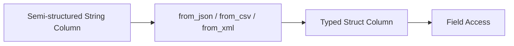

# :material-file-code: Structure Functions

Structure functions parse, generate, and manipulate semi-structured data formats
such as **JSON**, **CSV**, and **XML** within Spark SQL. They bridge the gap between
raw string data and Spark's typed column system.

## :material-sitemap: Overview



## :material-pin: Functions by Format

### JSON

| Function                      | Direction       | Description                             |
| ----------------------------- | --------------- | --------------------------------------- |
| `FROM_JSON(str, schema)`      | String → Struct | Parse JSON string into a struct/array   |
| `TO_JSON(expr)`               | Struct → String | Convert struct/map/array to JSON string |
| `GET_JSON_OBJECT(json, path)` | Extract         | Extract value using JSONPath            |
| `JSON_TUPLE(json, keys…)`     | Extract         | Extract multiple keys at once           |
| `JSON_ARRAY_LENGTH(json)`     | Inspect         | Count elements in a JSON array          |
| `JSON_OBJECT_KEYS(json)`      | Inspect         | Get all keys of a JSON object           |
| `SCHEMA_OF_JSON(json)`        | Inspect         | Infer schema DDL from JSON sample       |

### CSV

| Function                         | Direction       | Description                      |
| -------------------------------- | --------------- | -------------------------------- |
| `FROM_CSV(str, schema, options)` | String → Struct | Parse CSV string into a struct   |
| `TO_CSV(expr)`                   | Struct → String | Convert struct to CSV string     |
| `SCHEMA_OF_CSV(csv)`             | Inspect         | Infer schema DDL from CSV sample |

### XML

| Function                    | Direction       | Description                      |
| --------------------------- | --------------- | -------------------------------- |
| `FROM_XML(str, schema)`     | String → Struct | Parse XML string into a struct   |
| `TO_XML(expr)`              | Struct → String | Convert struct to an XML string  |
| `SCHEMA_OF_XML(xml)`        | Inspect         | Infer schema DDL from XML sample |
| `XPATH(xml, xpath)`         | Extract         | Extract string array via XPath   |
| `XPATH_STRING(xml, xpath)`  | Extract         | Extract single string value      |
| `XPATH_BOOLEAN(xml, xpath)` | Extract         | Evaluate XPath as boolean        |
| `XPATH_INT(xml, xpath)`     | Extract         | Extract integer value            |
| `XPATH_LONG(xml, xpath)`    | Extract         | Extract long value               |
| `XPATH_DOUBLE(xml, xpath)`  | Extract         | Extract double value             |
| `XPATH_FLOAT(xml, xpath)`   | Extract         | Extract float value              |
| `XPATH_SHORT(xml, xpath)`   | Extract         | Extract short value              |

!!! info "`FROM_XML`/`TO_XML`/`SCHEMA_OF_XML` — Spark 4.0+"

    These native struct-parsing XML functions (mirroring `FROM_JSON`/`TO_JSON`)
    were added alongside the built-in XML data source. Verified on Spark 4.2:
    `FROM_XML('<person><name>Alice</name><age>30</age></person>', 'name STRING, age INT')`
    → `{Alice, 30}`. Older Spark versions only expose the `XPATH_*` extraction
    family shown below.

## :material-flask-outline: Quick Examples

### :material-animation-play: Interactive Visualization — Parse vs Serialize Direction

<div id="viz-structure-direction" class="ts-viz"></div>

Pick a format (JSON, CSV, or XML) to see which functions parse **into** a
struct and which serialize **out of** one — the same `FROM_*` / `TO_*`
naming convention holds across all three formats in Spark 4.

```sql
-- Parse JSON into a struct
SELECT FROM_JSON('{"name":"Alice","age":30}', 'name STRING, age INT') AS parsed;

-- Convert struct to JSON
SELECT TO_JSON(NAMED_STRUCT('product', 'laptop', 'price', 999.99)) AS json_str;

-- Extract from JSON using path
SELECT GET_JSON_OBJECT('{"store":{"book":"Spark"}}', '$.store.book') AS title;

-- Parse CSV
SELECT FROM_CSV('Alice,30,Engineering', 'name STRING, age INT, dept STRING') AS parsed;

-- Convert struct to CSV
SELECT TO_CSV(NAMED_STRUCT('name', 'Alice', 'age', 30)) AS csv_str;

-- XPath extraction
SELECT XPATH_STRING('<root><name>Spark</name></root>', '/root/name') AS val;

-- Parse XML into a struct (Spark 4.0+)
SELECT FROM_XML('<person><name>Alice</name><age>30</age></person>', 'name STRING, age INT') AS parsed;
```

## :material-magnify: Shared Parse-Mode Behavior

`FROM_JSON`, `FROM_CSV`, and `FROM_XML` all support the same `mode` option:

| Mode                   | Behavior on malformed input                                                                  |
| ---------------------- | -------------------------------------------------------------------------------------------- |
| `PERMISSIVE` (default) | Returns the struct with unparseable fields set to `NULL` — the row itself is **not** dropped |
| `FAILFAST`             | Raises `MALFORMED_RECORD_IN_PARSING` and aborts the query                                    |
| `DROPMALFORMED`        | *(CSV only, at the DataFrameReader level)* drops the bad row entirely                        |

Verified on Spark 4.2 — all three families behave the same way:

```sql
SELECT from_json('{"a":1, bad}', 'a INT') AS parsed;
-- {NULL}   (PERMISSIVE default — whole struct nulled, no error)

SELECT from_json('{"a":1, bad}', 'a INT', map('mode', 'FAILFAST')) AS parsed;
-- ERROR [MALFORMED_RECORD_IN_PARSING.WITHOUT_SUGGESTION]

SELECT from_csv('a,notanint', 'x STRING, y INT') AS parsed;
-- {a, NULL}  (same PERMISSIVE default)

SELECT from_xml('<a><b>notanint</b></a>', 'b INT') AS parsed;
-- {NULL}
```

> **Gotcha:** the default `PERMISSIVE` mode nulls the *whole struct* for
> `FROM_JSON`/`FROM_XML` when the raw text itself can't be parsed, but nulls
> only the *offending field* when the text parses fine and just has a
> type mismatch (as in the `FROM_CSV` example above). Always check for a
> fully-`NULL` struct before trusting individual field values downstream.

## :material-brain: When to Use

| Scenario                                  | Function                                           |
| ----------------------------------------- | -------------------------------------------------- |
| Ingest JSON columns from external sources | `FROM_JSON`                                        |
| Serialize structs for output/export       | `TO_JSON`, `TO_CSV`, `TO_XML`                      |
| Quick field extraction from JSON strings  | `GET_JSON_OBJECT`, `JSON_TUPLE`                    |
| Inspect JSON structure                    | `JSON_OBJECT_KEYS`, `JSON_ARRAY_LENGTH`            |
| Parse a whole XML payload into a struct   | `FROM_XML` *(Spark 4.0+)*                          |
| Lightweight single-value XML extraction   | `XPATH_*` family                                   |
| Discover schema of raw data               | `SCHEMA_OF_JSON`, `SCHEMA_OF_CSV`, `SCHEMA_OF_XML` |
