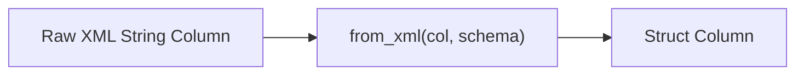

# :material-file-code: XML Functions

Spark SQL provides the `XPATH` family of functions to **extract values from XML strings** using
XPath expressions — useful for processing XML payloads stored in string columns.

## :material-sitemap: Overview



### :material-animation-play: Interactive Visualization — XPath Node Selection

<div id="viz-xpath-tree" class="ts-viz"></div>

Pick an XPath expression to see which nodes of a small XML tree it selects
— `XPATH` returns every match as an array, while `XPATH_STRING` returns
only the first one.

## :material-pin: Available Functions

| Function                    | Return Type     | Description                              |
| --------------------------- | --------------- | ---------------------------------------- |
| `XPATH(xml, xpath)`         | `ARRAY<STRING>` | All matching node values as string array |
| `XPATH_STRING(xml, xpath)`  | `STRING`        | Text content of first matching node      |
| `XPATH_BOOLEAN(xml, xpath)` | `BOOLEAN`       | XPath evaluated as boolean               |
| `XPATH_INT(xml, xpath)`     | `INT`           | Integer value (0 if no match)            |
| `XPATH_LONG(xml, xpath)`    | `BIGINT`        | Long value (0 if no match)               |
| `XPATH_SHORT(xml, xpath)`   | `SMALLINT`      | Short value (0 if no match)              |
| `XPATH_FLOAT(xml, xpath)`   | `FLOAT`         | Float value (NaN if non-numeric match)   |
| `XPATH_DOUBLE(xml, xpath)`  | `DOUBLE`        | Double value (NaN if non-numeric match)  |
| `XPATH_NUMBER(xml, xpath)`  | `DOUBLE`        | Alias for `XPATH_DOUBLE`                 |

## :material-magnify: Behavior

1. All functions take two arguments: an XML string and an XPath expression.
2. Numeric functions return `0` if no match is found, or `NaN` for non-numeric matches.
3. `XPATH_STRING` returns the text content of the **first** matching node.
4. `XPATH` returns **all** matching values as a string array.
5. `XPATH_BOOLEAN` returns `TRUE` if the XPath matches any node, or if the expression evaluates to true.
6. All functions return `NULL` if the XML input is `NULL`.

______________________________________________________________________

## :material-pin: FROM_XML / TO_XML / SCHEMA_OF_XML — Struct Parsing (Spark 4.0+)

Unlike the `XPATH_*` family (single-value extraction), these three functions
mirror `FROM_JSON`/`TO_JSON`/`SCHEMA_OF_JSON` — they parse an **entire** XML
document into a typed struct (or serialize one back to XML) in one call.

### Syntax

```sql
FROM_XML(xml_string, schema [, options])
TO_XML(struct_expr [, options])
SCHEMA_OF_XML(xml_string [, options])
```

### :material-flask-outline: Examples

```sql
-- Parse a whole element tree into a struct
SELECT FROM_XML('<person><name>Alice</name><age>30</age></person>', 'name STRING, age INT') AS parsed;
-- Result: {name: Alice, age: 30}

-- Attributes are addressed with the `attributePrefix` option (default '_')
SELECT FROM_XML(
  '<book lang="en"><title>Spark SQL</title></book>',
  'STRUCT<_lang: STRING, title: STRING>',
  MAP('attributePrefix', '_')
) AS parsed;
-- Result: {_lang: en, title: Spark SQL}

-- Serialize a struct to XML; rowTag controls the wrapping element name
SELECT TO_XML(NAMED_STRUCT('name', 'Alice', 'age', 30), MAP('rowTag', 'person')) AS xml;
-- Result:
-- <person>
--     <name>Alice</name>
--     <age>30</age>
-- </person>

-- Infer schema from an XML sample
SELECT SCHEMA_OF_XML('<a><b>1</b></a>');
-- Result: 'STRUCT<b: BIGINT>'

-- Malformed field values null just that field, same PERMISSIVE default as FROM_JSON/FROM_CSV
SELECT FROM_XML('<a><b>notanint</b></a>', 'b INT') AS parsed;
-- Result: {NULL}
```

> **Verified (Spark 4.2).** Prefer `FROM_XML` over stringing together several
> `XPATH_*` calls when you need **multiple fields** out of the same document
> — one parse pass beats N separate XPath evaluations, exactly like
> `FROM_JSON` vs. repeated `GET_JSON_OBJECT` calls.

______________________________________________________________________

## :material-flask-outline: Practical Examples — XPath Extraction

### :material-toy-brick: 1. Extract All Matching Values

```sql
SELECT XPATH(
  '<a><b>b1</b><b>b2</b><b>b3</b><c>c1</c><c>c2</c></a>',
  'a/b/text()'
) AS values;
-- Result: ['b1', 'b2', 'b3']
```

### :material-toy-brick: 2. Extract First String Value

```sql
SELECT XPATH_STRING('<a><b>hello</b><c>world</c></a>', 'a/c') AS val;
-- Result: world
```

### :material-toy-brick: 3. Check Node Existence

```sql
SELECT XPATH_BOOLEAN('<a><b>1</b></a>', 'a/b') AS exists;
-- Result: true

SELECT XPATH_BOOLEAN('<a><b>1</b></a>', 'a/x') AS exists;
-- Result: false
```

### :material-toy-brick: 4. Sum Numeric Nodes

```sql
SELECT XPATH_DOUBLE('<a><b>1</b><b>2</b><b>3</b></a>', 'sum(a/b)') AS total;
-- Result: 6.0

SELECT XPATH_INT('<prices><p>10</p><p>20</p></prices>', 'sum(prices/p)') AS total;
-- Result: 30
```

### :material-toy-brick: 5. Count Matching Nodes

```sql
SELECT XPATH_INT('<a><b>1</b><b>2</b><b>3</b></a>', 'count(a/b)') AS cnt;
-- Result: 3
```

### :material-toy-brick: 6. Conditional XPath

```sql
SELECT XPATH_STRING(
  '<employees><emp><name>Alice</name><dept>Engineering</dept></emp><emp><name>Bob</name><dept>Sales</dept></emp></employees>',
  '//emp[dept="Engineering"]/name'
) AS eng_employee;
-- Result: Alice
```

### :material-toy-brick: 7. Process XML Column

```sql
CREATE OR REPLACE TEMP VIEW xml_data AS
SELECT * FROM VALUES
  ('<order><item>book</item><qty>2</qty><price>15.99</price></order>'),
  ('<order><item>pen</item><qty>10</qty><price>1.50</price></order>')
AS xml_data(payload);

SELECT
  XPATH_STRING(payload, 'order/item') AS item,
  XPATH_INT(payload, 'order/qty') AS quantity,
  XPATH_DOUBLE(payload, 'order/price') AS price
FROM xml_data;
-- (book, 2, 15.99), (pen, 10, 1.50)
```

### :material-toy-brick: 8. Extract Attributes

```sql
SELECT XPATH_STRING(
  '<book lang="en"><title>Spark SQL</title></book>',
  'book/@lang'
) AS language;
-- Result: en
```

## :material-clipboard-list-outline: Numeric Function Comparison

| Function       | Return Type | No Match | Non-Numeric Match |
| -------------- | ----------- | -------- | ----------------- |
| `XPATH_INT`    | INT         | 0        | 0                 |
| `XPATH_LONG`   | BIGINT      | 0        | 0                 |
| `XPATH_SHORT`  | SMALLINT    | 0        | 0                 |
| `XPATH_FLOAT`  | FLOAT       | 0.0      | NaN               |
| `XPATH_DOUBLE` | DOUBLE      | 0.0      | NaN               |
| `XPATH_NUMBER` | DOUBLE      | 0.0      | NaN               |

## :material-brain: When to Use

| Scenario                                 | Function                                  |
| ---------------------------------------- | ----------------------------------------- |
| Extract all matching values as array     | `XPATH`                                   |
| Get single text value                    | `XPATH_STRING`                            |
| Check if node exists                     | `XPATH_BOOLEAN`                           |
| Extract numeric value with XPath math    | `XPATH_INT`, `XPATH_DOUBLE`, etc.         |
| Count matching nodes                     | `XPATH_INT(xml, 'count(...)')`            |
| Filter by attribute or child value       | XPath predicates (`//node[@attr="val"]`)  |
| Process XML column row-by-row            | Combine `XPATH_*` in SELECT               |
| Extract several fields from one document | `FROM_XML` *(Spark 4.0+, one parse pass)* |
| Serialize a struct back to XML           | `TO_XML` *(Spark 4.0+)*                   |

> **Tip:** For complex XML processing, consider parsing XML files with the `com.databricks.spark.xml`
> reader. Use `XPATH_*` functions for lightweight extraction from XML strings in columns.
