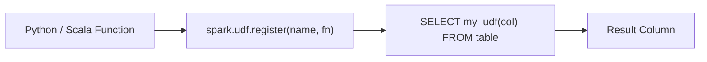

# :material-code-braces-box: User-Defined Functions (UDFs)

User-Defined Functions extend Spark SQL with **custom logic** written in Python, Scala, or Java.
They allow you to call arbitrary code from SQL queries when built-in functions are insufficient.

## :material-sitemap: Overview



## :material-pin: Types of UDFs

| Type                        | Language              | Input → Output       | Performance | Use Case                     |
| --------------------------- | --------------------- | -------------------- | ----------- | ---------------------------- |
| **Scalar UDF**              | Python / Scala / Java | Row → Single value   | Moderate    | Per-row transformations      |
| **Pandas UDF** (Vectorized) | Python (Pandas)       | Batch → Batch        | Fast        | Bulk numeric / ML operations |
| **UDAF**                    | Scala / Java          | Group → Single value | Fast        | Custom aggregations          |
| **UDTF**                    | Python / Scala / Java | Row → Multiple rows  | Moderate    | Custom row generators        |

## :material-magnify: How UDFs Work

1. **Register** a function with `spark.udf.register()` or `CREATE FUNCTION`.
2. **Call** it in SQL like any built-in function.
3. Spark serializes each row's data, sends it to the UDF, and deserializes the result.
4. Unlike SQL macros, UDFs are **opaque to the Catalyst optimizer** — no predicate pushdown or constant folding through UDFs.

!!! info "Spark 4.0+: scalar Python UDFs are Arrow-optimized by default"

    Starting in Spark 4.0, `spark.sql.execution.pythonUDF.arrow.enabled` defaults to
    **`true`**. A plain `@udf` scalar function now compiles to an `ArrowEvalPython`
    node instead of the legacy row-at-a-time `BatchEvalPython` node — the same
    columnar transfer format `@pandas_udf` has always used. Verified on Spark 4.2:

    ```python
    df.select(square(df.x)).explain()
    # == Physical Plan ==
    # *(2) Project [pythonUDF0#4 AS square(x)#3]
    # +- ArrowEvalPython [square(id#0L)#2], [pythonUDF0#4], 101
    #    +- *(1) Range (0, 3, step=1, splits=1)
    ```

    This closes most of the raw speed gap between plain scalar UDFs and Pandas
    UDFs, but the *semantics* stay the same — the function still runs opaquely
    to Catalyst and still executes once per row logically, just batched for
    transport.

### :material-animation-play: Interactive Visualization — Row Path Through a UDF

<div id="viz-udf-row-path" class="ts-viz"></div>

Compare how a row travels for a **Row UDF** (legacy `BatchEvalPython`, one row
serialized at a time) vs. an **Arrow UDF** (Spark 4.0+ default, a whole
column batch serialized at once).

## :material-flask-outline: Quick Examples

### Python Scalar UDF

```python
from pyspark.sql.functions import udf
from pyspark.sql.types import StringType

@udf(returnType=StringType())
def greet(name):
    return f"Hello, {name}!"

spark.udf.register("greet", greet)
```

```sql
SELECT greet('Alice');
-- Result: 'Hello, Alice!'
```

### SQL-Registered UDF

```sql
CREATE OR REPLACE TEMPORARY FUNCTION square AS 'com.example.SquareUDF';
SELECT square(5);
-- Result: 25
```

### Pandas UDF (Vectorized)

```python
import pandas as pd
from pyspark.sql.functions import pandas_udf

@pandas_udf("double")
def pandas_double(s: pd.Series) -> pd.Series:
    return s * 2

spark.udf.register("pandas_double", pandas_double)
```

```sql
SELECT pandas_double(price) FROM products;
```

### Python UDTF (Row → Multiple Rows)

```python
from pyspark.sql.functions import udtf

@udtf(returnType="word: string, len: int")
class SplitWords:
    def eval(self, s: str):
        for w in s.split():
            yield (w, len(w))

spark.udtf.register("split_words", SplitWords)
```

```sql
SELECT * FROM split_words('the quick fox');
-- word='the' len=3, word='quick' len=5, word='fox' len=3

-- LATERAL join: call the UDTF once per input row
SELECT * FROM VALUES ('a b'), ('c d e') AS t(s), LATERAL split_words(s);
```

> **Verified (Spark 4.2):** a `LATERAL` correlated call re-invokes `eval()` once
> per outer row, fanning `'a b'` into 2 rows and `'c d e'` into 3 — exactly the
> "Row → Multiple rows" behavior in the table above.

## :material-brain: UDFs vs Alternatives

| Feature               | UDF                                                    | SQL Macro                                            | Built-in Function                               |
| --------------------- | ------------------------------------------------------ | ---------------------------------------------------- | ----------------------------------------------- |
| Custom logic          | :material-check-circle-outline: Any language           | :material-close-circle-outline: SQL expressions only | :material-close-circle-outline: Fixed set       |
| Performance           | Slower (serialization)                                 | Fast (inline)                                        | Fastest (native)                                |
| Catalyst optimization | :material-close-circle-outline: Opaque                 | :material-check-circle-outline: Fully optimized      | :material-check-circle-outline: Fully optimized |
| Scope                 | Session or permanent                                   | Session only                                         | Always available                                |
| Complex logic         | :material-check-circle-outline: Loops, APIs, libraries | :material-close-circle-outline: Pure expressions     | :material-close-circle-outline: Limited         |

> **Rule of thumb:** Prefer built-in functions → SQL macros → Pandas UDFs → scalar UDFs.
> Only use scalar UDFs when no other option exists.

See the [UDF Guide](udf.md) for full syntax, registration patterns, and best practices.
