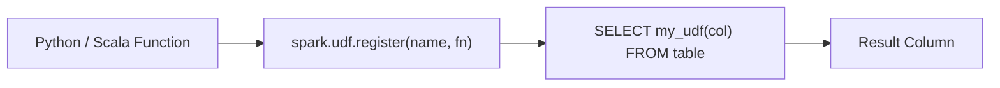

# :material-code-braces-box: UDF Guide

Complete reference for creating, registering, and using User-Defined Functions in Spark SQL.

## :material-sitemap: Overview



______________________________________________________________________

!!! info "Spark 4.0+: scalar Python UDFs use Arrow by default"

    `spark.sql.execution.pythonUDF.arrow.enabled` defaults to `true` in Spark
    4.0+, so a plain `@udf` now plans as `ArrowEvalPython` (columnar batch
    transfer) instead of the legacy row-at-a-time `BatchEvalPython`. Set it to
    `false` to restore the pre-4.0 row-oriented path (useful when a UDF relies
    on Python-native types Arrow can't cheaply represent).

### :material-animation-play: Interactive Visualization — Row UDF vs. Arrow UDF Transfer

<div id="viz-udf-row-path" class="ts-viz"></div>

Toggle between the legacy row-at-a-time path and the Spark 4.0+ default
Arrow-batched path to see why batching a whole column cuts serialization
overhead.

## :material-pin: Python Scalar UDFs

### Registration via Decorator

```python
from pyspark.sql.functions import udf
from pyspark.sql.types import IntegerType

@udf(returnType=IntegerType())
def square(x):
    return x * x

spark.udf.register("square", square)
```

### Registration via Lambda

```python
from pyspark.sql.types import StringType

spark.udf.register("to_upper", lambda s: s.upper() if s else None, StringType())
```

### Usage in SQL

```sql
SELECT square(5) AS result;
-- Result: 25

SELECT name, to_upper(name) AS upper_name
FROM employees;
```

### Complex Return Types

```python
from pyspark.sql.types import StructType, StructField, StringType, IntegerType

schema = StructType([
    StructField("first", StringType()),
    StructField("last", StringType())
])

@udf(returnType=schema)
def split_name(full_name):
    parts = full_name.split(" ", 1)
    return (parts[0], parts[1] if len(parts) > 1 else "")

spark.udf.register("split_name", split_name)
```

```sql
SELECT split_name('John Doe') AS name;
-- Result: {first: John, last: Doe}

SELECT split_name(full_name).first AS first_name FROM contacts;
```

### NULL Handling

```python
@udf(returnType=IntegerType())
def safe_length(s):
    return len(s) if s is not None else None

spark.udf.register("safe_length", safe_length)
```

```sql
SELECT safe_length('hello');  -- 5
SELECT safe_length(NULL);     -- NULL
```

> **Important:** Always handle `None` in Python UDFs — Spark passes NULL values as `None`.

### Type Mismatches Fail at Runtime, Not Registration Time

`@udf(returnType=...)` does **not** validate that your function actually returns
that type when you register it — Spark trusts the declared type until a task
tries to serialize a mismatched value back through Arrow. Verified on Spark 4.2:

```python
@udf(returnType=IntegerType())
def bad(x):
    return "not an int"          # declared IntegerType, but returns a string

spark.range(3).select(bad("id")).show()
```

```text
pyspark.errors.exceptions.captured.PythonException:
  [PYTHON_EXCEPTION] An exception was thrown from the Python worker:
  pyarrow.lib.ArrowInvalid: Failed to parse string: 'not an int' as a scalar of type int32
```

The error surfaces as a task failure at **execution time** (inside the Arrow
cast), not as a schema-validation error at `.select()` time — so a UDF with a
wrong return type can pass code review and CI on empty/mocked data and still
blow up on real data.

### Exceptions Raised Inside a UDF Propagate as Job Failures

There's no implicit try/except around your UDF body. An uncaught exception
inside `eval()`/the UDF function aborts the Spark job with a
`PythonException` wrapping your original traceback (verified on Spark 4.2):

```python
@udf(returnType=IntegerType())
def boom(x):
    raise ValueError("custom failure")

df.select(boom(df.x)).show()
# pyspark.errors.exceptions.captured.PythonException: [PYTHON_EXCEPTION]
#   An exception was thrown from the Python worker:
#   ValueError: custom failure
```

> **Pattern:** wrap risky logic in `try/except` inside the UDF and return
> `None` (or a sentinel) on failure — don't let a single bad row abort the
> whole job unless that's genuinely the desired behavior.

______________________________________________________________________

## :material-pin: Pandas UDFs (Vectorized)

Pandas UDFs operate on **batches of rows** using Pandas Series/DataFrames, avoiding the
per-row serialization overhead of regular UDFs. They are 3–100x faster for numeric operations.

### Series → Series (Scalar)

```python
import pandas as pd
from pyspark.sql.functions import pandas_udf

@pandas_udf("double")
def double_price(prices: pd.Series) -> pd.Series:
    return prices * 2

spark.udf.register("double_price", double_price)
```

```sql
SELECT product, double_price(price) AS doubled FROM products;
```

### Series → Scalar (Grouped Aggregate)

```python
@pandas_udf("double")
def weighted_avg(values: pd.Series, weights: pd.Series) -> float:
    return (values * weights).sum() / weights.sum()

spark.udf.register("weighted_avg", weighted_avg)
```

```sql
SELECT category, weighted_avg(price, quantity) AS wavg
FROM sales
GROUP BY category;
```

### Iterator of Series (Batched)

```python
from typing import Iterator

@pandas_udf("string")
def batch_classify(batches: Iterator[pd.Series]) -> Iterator[pd.Series]:
    for batch in batches:
        yield batch.apply(lambda x: "high" if x > 100 else "low")

spark.udf.register("classify", batch_classify)
```

```sql
SELECT amount, classify(amount) AS category FROM transactions;
```

______________________________________________________________________

## :material-pin: Python UDTFs (User-Defined Table Functions)

A UDTF maps **one input row to zero, one, or many output rows** — the
row-generator counterpart to a scalar UDF. Define `eval()` as a generator
(`yield` one tuple per output row) and register with `spark.udtf.register()`.

### :material-animation-play: Interactive Visualization — Scalar UDF vs UDTF Fan-Out

<div id="viz-udtf-fanout" class="ts-viz"></div>

A scalar UDF always emits exactly one output value per input row. A UDTF's
`eval()` can `yield` any number of rows — zero, one, or many — per call.

```python
from pyspark.sql.functions import udtf

@udtf(returnType="word: string, len: int")
class SplitWords:
    def eval(self, s: str):
        for w in s.split():
            yield (w, len(w))

spark.udtf.register("split_words", SplitWords)
```

```sql
SELECT * FROM split_words('the quick fox');
-- +-----+---+
-- | word|len|
-- +-----+---+
-- |  the|  3|
-- |quick|  5|
-- |  fox|  3|
-- +-----+---+
```

### LATERAL Correlated Calls

Use `LATERAL` to invoke a UDTF once **per row** of an outer table, passing
that row's column(s) as arguments — analogous to a `CROSS APPLY` in T-SQL:

```sql
SELECT * FROM VALUES ('a b'), ('c d e') AS t(s), LATERAL split_words(s);
```

```text
+-----+----+---+
|    s|word|len|
+-----+----+---+
|  a b|   a|  1|
|  a b|   b|  1|
|c d e|   c|  1|
|c d e|   d|  1|
|c d e|   e|  1|
+-----+----+---+
```

> **Verified (Spark 4.2):** `'a b'` fans out into 2 rows and `'c d e'` into 3
> — the outer row's `s` value is repeated on every generated row, exactly
> like a `LATERAL`/`CROSS APPLY` in other SQL engines.

______________________________________________________________________

## :material-pin: Scala / Java UDFs

### Scala UDF Registration

```scala
spark.udf.register("cube", (x: Int) => x * x * x)
```

```sql
SELECT cube(3);
-- Result: 27
```

### Java UDF Class

```java
import org.apache.spark.sql.api.java.UDF1;

public class SquareUDF implements UDF1<Integer, Integer> {
    @Override
    public Integer call(Integer x) {
        return x * x;
    }
}
```

```sql
CREATE OR REPLACE TEMPORARY FUNCTION square AS 'com.example.SquareUDF';
SELECT square(5);
-- Result: 25
```

______________________________________________________________________

## :material-pin: User-Defined Aggregate Functions (UDAFs)

UDAFs compute a single result from a group of rows — like built-in `SUM` or `AVG` but with
custom logic.

### Python (Pandas Grouped Aggregate)

```python
@pandas_udf("double")
def geometric_mean(values: pd.Series) -> float:
    import numpy as np
    return np.exp(np.log(values).mean())

spark.udf.register("geometric_mean", geometric_mean)
```

```sql
SELECT category, geometric_mean(price) AS geo_mean
FROM products
GROUP BY category;
```

### Scala (Aggregator API)

```scala
import org.apache.spark.sql.{Encoder, Encoders}
import org.apache.spark.sql.expressions.Aggregator

case class Average(sum: Double, count: Long)

object CustomAvg extends Aggregator[Double, Average, Double] {
  def zero: Average = Average(0.0, 0L)
  def reduce(buf: Average, input: Double): Average =
    Average(buf.sum + input, buf.count + 1)
  def merge(b1: Average, b2: Average): Average =
    Average(b1.sum + b2.sum, b1.count + b2.count)
  def finish(buf: Average): Double = buf.sum / buf.count
  def bufferEncoder: Encoder[Average] = Encoders.product
  def outputEncoder: Encoder[Double] = Encoders.scalaDouble
}

spark.udf.register("custom_avg", functions.udaf(CustomAvg))
```

```sql
SELECT department, custom_avg(salary) FROM employees GROUP BY department;
```

______________________________________________________________________

## :material-pin: SQL CREATE FUNCTION

### Temporary Function (Session-Scoped)

```sql
CREATE OR REPLACE TEMPORARY FUNCTION my_func AS 'com.example.MyUDF';
```

### Permanent Function (Catalog-Scoped)

```sql
CREATE OR REPLACE FUNCTION my_catalog.my_schema.my_func AS 'com.example.MyUDF'
USING JAR 'hdfs:///libs/my-udfs.jar';
```

### Drop Function

```sql
DROP TEMPORARY FUNCTION IF EXISTS my_func;
DROP FUNCTION IF EXISTS my_catalog.my_schema.my_func;
```

______________________________________________________________________

## :material-alert:️ Performance Considerations

| Factor                 | Impact                                                  | Mitigation                                                                               |
| ---------------------- | ------------------------------------------------------- | ---------------------------------------------------------------------------------------- |
| Serialization overhead | Python UDFs serialize/deserialize every row             | Spark 4.0+ batches this via Arrow by default; Pandas UDFs still win for bulk numeric ops |
| Catalyst opacity       | Optimizer cannot push predicates through UDFs           | Filter before UDF call                                                                   |
| NULL handling          | Python receives `None`, Scala receives `null`           | Always check for NULLs                                                                   |
| Type conversion        | Python ↔ JVM type marshalling adds latency              | Use native types, avoid complex structs                                                  |
| Parallelism            | UDFs run within Spark tasks                             | Avoid blocking I/O in UDFs                                                               |
| Silent type mismatch   | Wrong `returnType` fails at execution, not registration | Add a test that runs the UDF through Spark, not just in isolation                        |

### Performance Hierarchy (Fastest → Slowest)

```
Built-in Functions > SQL Macros > Pandas UDFs > Scala UDFs > Python Scalar UDFs
```

______________________________________________________________________

## :material-flask-outline: Common Patterns

### Pattern 1: Lookup / Enrichment

```python
# Broadcast a lookup dict, use in UDF
country_map = {"US": "United States", "UK": "United Kingdom", "IN": "India"}
broadcast_map = spark.sparkContext.broadcast(country_map)

@udf(returnType=StringType())
def country_name(code):
    return broadcast_map.value.get(code, "Unknown")

spark.udf.register("country_name", country_name)
```

```sql
SELECT country_code, country_name(country_code) AS name FROM customers;
```

### Pattern 2: Regex Extraction

```python
import re

@udf(returnType=StringType())
def extract_domain(email):
    if email is None:
        return None
    match = re.search(r'@(.+)', email)
    return match.group(1) if match else None

spark.udf.register("extract_domain", extract_domain)
```

```sql
SELECT email, extract_domain(email) AS domain FROM users;
-- alice@gmail.com → gmail.com
```

### Pattern 3: Conditional Business Logic

```python
@udf(returnType=StringType())
def risk_tier(score):
    if score is None:
        return "Unknown"
    if score >= 800:
        return "Low"
    if score >= 650:
        return "Medium"
    return "High"

spark.udf.register("risk_tier", risk_tier)
```

```sql
SELECT customer_id, credit_score, risk_tier(credit_score) AS tier FROM accounts;
```

______________________________________________________________________

## :material-brain: When to Use UDFs

| Scenario                     | Recommended Approach                                             |
| ---------------------------- | ---------------------------------------------------------------- |
| Simple math / string ops     | :material-close-circle-outline: Use built-in functions           |
| Reusable SQL expressions     | :material-close-circle-outline: Use SQL macros                   |
| Numeric batch operations     | :material-check-circle-outline: Pandas UDF                       |
| Complex business logic       | :material-check-circle-outline: Scalar UDF                       |
| External API calls / lookups | :material-check-circle-outline: Scalar UDF with broadcast        |
| Custom aggregation           | :material-check-circle-outline: Pandas grouped UDF or Scala UDAF |
| Row generation (1→N rows)    | :material-check-circle-outline: UDTF                             |

> **Tip:** Always benchmark UDF vs built-in alternatives. A chain of built-in functions
> is almost always faster than a single UDF doing the same work.
