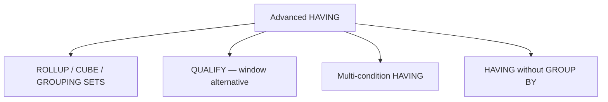

# :material-lightning-bolt: Advanced HAVING

Advanced patterns for HAVING: ROLLUP, CUBE, GROUPING SETS, the QUALIFY alternative for window functions, and multi-condition filters.

---

## :material-sitemap: Overview



---

## :material-layers: HAVING with ROLLUP

`ROLLUP` generates subtotals and a grand total. Use `HAVING` to keep only the aggregated rows you need.

```sql
-- Keep only rows where the subtotal or grand total exceeds 100 000
SELECT
    COALESCE(region, 'ALL')         AS region,
    COALESCE(product, 'ALL')        AS product,
    SUM(amount)                     AS total_revenue
FROM orders
GROUP BY ROLLUP(region, product)
HAVING SUM(amount) > 100000
ORDER BY region NULLS LAST, product NULLS LAST;
```

---

## :material-grid: HAVING with CUBE

`CUBE` generates every combination of grouping columns. Filter to keep only meaningful aggregation levels.

```sql
SELECT
    COALESCE(CAST(YEAR(order_date) AS STRING), 'ALL YEARS')  AS year,
    COALESCE(region, 'ALL REGIONS')                           AS region,
    SUM(amount)                                               AS revenue
FROM orders
GROUP BY CUBE(YEAR(order_date), region)
HAVING SUM(amount) > 50000;
```

---

## :material-format-list-group: HAVING with GROUPING SETS

`GROUPING SETS` gives explicit control over which combinations are computed.

```sql
-- Report at region level and product level separately; discard tiny groups
SELECT
    region,
    product_category,
    SUM(amount)     AS total_revenue,
    COUNT(*)        AS order_count
FROM orders
GROUP BY GROUPING SETS (
    (region),
    (product_category),
    ()                     -- grand total
)
HAVING SUM(amount) > 25000;
```

### Using GROUPING() to identify aggregate rows

```sql
SELECT
    CASE WHEN GROUPING(region) = 1 THEN 'ALL REGIONS' ELSE region END  AS region_label,
    CASE WHEN GROUPING(product) = 1 THEN 'ALL PRODUCTS' ELSE product END AS product_label,
    SUM(amount)  AS revenue
FROM orders
GROUP BY ROLLUP(region, product)
HAVING SUM(amount) > 10000;
```

---

## :material-window-maximize: QUALIFY — HAVING for Window Functions

`QUALIFY` filters rows **after** window functions have been computed, playing the same role for window functions that `HAVING` plays for aggregates.

```sql
-- Keep only the most recent order per customer (window function version)
SELECT
    customer_id,
    order_id,
    order_date,
    ROW_NUMBER() OVER (PARTITION BY customer_id ORDER BY order_date DESC) AS rn
FROM orders
QUALIFY rn = 1;

-- Top-3 products by revenue per region
SELECT
    region,
    product_id,
    SUM(amount)                                                       AS revenue,
    RANK() OVER (PARTITION BY region ORDER BY SUM(amount) DESC)       AS revenue_rank
FROM orders
GROUP BY region, product_id
HAVING SUM(amount) > 0          -- optional pre-filter
QUALIFY revenue_rank <= 3;
```

!!! note
    `QUALIFY` is a Databricks / Spark SQL extension. It is not available in standard ANSI SQL.
    In non-Databricks Spark, wrap the query in a subquery and filter in the outer `WHERE`.

---

## :material-filter-multiple: Multi-Condition HAVING

```sql
-- Multiple aggregate conditions with AND / OR
SELECT
    salesperson_id,
    COUNT(*)            AS deal_count,
    SUM(deal_value)     AS total_value,
    AVG(deal_value)     AS avg_value
FROM deals
WHERE close_date >= '2024-01-01'
GROUP BY salesperson_id
HAVING COUNT(*)        >= 10          -- at least 10 deals
   AND SUM(deal_value) > 200000       -- above revenue threshold
   AND AVG(deal_value) > 5000;        -- above average deal size

-- OR condition: keep very active or very high-value reps
SELECT
    salesperson_id,
    COUNT(*)        AS deal_count,
    SUM(deal_value) AS total_value
FROM deals
GROUP BY salesperson_id
HAVING COUNT(*) > 50
    OR SUM(deal_value) > 500000;
```

---

## :material-table-of-contents: HAVING without GROUP BY

When `GROUP BY` is absent, `HAVING` treats the **entire table as a single group**.

```sql
-- Return all orders only if the table contains at least 1 000 rows
SELECT order_id, amount FROM orders
HAVING COUNT(*) >= 1000;
-- Returns all rows or no rows (depending on total row count)

-- Practical: guard against running on an empty table
SELECT AVG(amount) AS global_avg
FROM orders
HAVING COUNT(*) > 0;
```

---

## :material-magnify: Behavior Notes

1. `ROLLUP(a, b)` generates `(a, b)`, `(a)`, and `()` — three grouping levels.
2. `CUBE(a, b)` generates `(a, b)`, `(a)`, `(b)`, and `()` — four levels.
3. `GROUPING SETS` gives full control; include `()` explicitly for the grand total.
4. `QUALIFY` is evaluated after `HAVING` in the logical order: `HAVING` → window computation → `QUALIFY`.
5. `GROUPING(col)` returns `1` if `col` is aggregated away in that row's grouping set, `0` otherwise.
