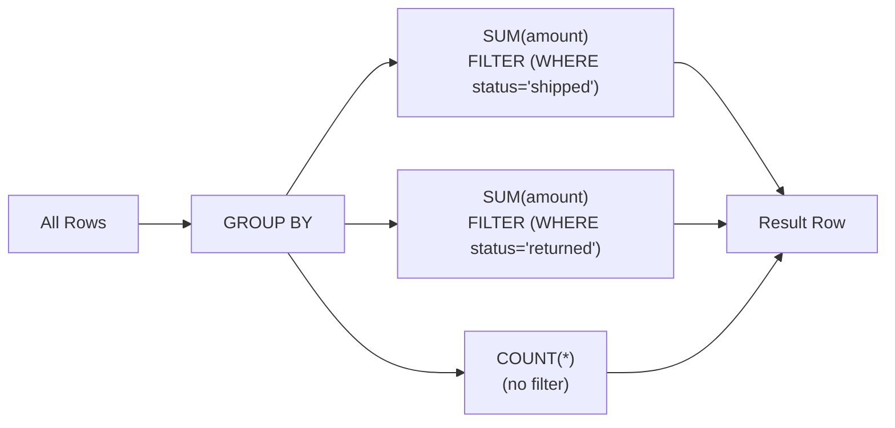

# :material-filter-plus-outline: FILTER Modifier

The `FILTER (WHERE ...)` clause applies a condition **to a single aggregate function**, allowing multiple conditional aggregations in one pass without separate subqueries or pivots.

---

## :material-sitemap: How It Works



Each aggregate with a `FILTER` only counts/sums rows that satisfy its condition — within the same group.

---

## :material-code-tags: Syntax

```sql
AGG_FUNCTION(expression) FILTER (WHERE boolean_condition)
```

Works with any aggregate: `SUM`, `COUNT`, `AVG`, `MAX`, `MIN`, `COLLECT_LIST`, etc.

---

## :material-flask-outline: Examples

### Conditional sums in one query

```sql
SELECT
    region,
    SUM(amount)                                          AS total_sales,
    SUM(amount) FILTER (WHERE status = 'shipped')        AS shipped_sales,
    SUM(amount) FILTER (WHERE status = 'returned')       AS returned_sales,
    SUM(amount) FILTER (WHERE status = 'pending')        AS pending_sales
FROM orders
GROUP BY region;
```

### Completion rate per department

```sql
SELECT
    department,
    COUNT(*)                                             AS total_tasks,
    COUNT(*) FILTER (WHERE status = 'done')              AS done_tasks,
    COUNT(*) FILTER (WHERE status = 'done')
        / NULLIF(COUNT(*), 0)                            AS completion_rate
FROM tasks
GROUP BY department;
```

### Date-range conditional aggregation

```sql
SELECT
    product_id,
    SUM(units) FILTER (WHERE sale_date BETWEEN '2024-01-01' AND '2024-03-31') AS q1_units,
    SUM(units) FILTER (WHERE sale_date BETWEEN '2024-04-01' AND '2024-06-30') AS q2_units,
    SUM(units) FILTER (WHERE sale_date BETWEEN '2024-07-01' AND '2024-09-30') AS q3_units,
    SUM(units) FILTER (WHERE sale_date BETWEEN '2024-10-01' AND '2024-12-31') AS q4_units
FROM sales
GROUP BY product_id;
```

### FILTER combined with HAVING

```sql
-- Keep only regions where the shipped ratio exceeds 90 %
SELECT
    region,
    SUM(amount)                                          AS total_revenue,
    SUM(amount) FILTER (WHERE status = 'shipped')        AS shipped_revenue
FROM orders
GROUP BY region
HAVING SUM(amount) FILTER (WHERE status = 'shipped')
     / NULLIF(SUM(amount), 0) > 0.9;
```

### COLLECT_LIST with FILTER

```sql
-- Collect only high-value order IDs per customer
SELECT
    customer_id,
    COLLECT_LIST(order_id) FILTER (WHERE amount > 1000)  AS big_order_ids
FROM orders
GROUP BY customer_id;
```

---

## :material-compare: FILTER vs CASE WHEN

Both achieve conditional aggregation. `FILTER` is cleaner and can enable better optimizations.

```sql
-- CASE WHEN approach (equivalent but more verbose)
SELECT
    region,
    SUM(CASE WHEN status = 'shipped' THEN amount ELSE 0 END) AS shipped_sales,
    SUM(CASE WHEN status = 'returned' THEN amount ELSE 0 END) AS returned_sales
FROM orders
GROUP BY region;

-- FILTER approach (preferred)
SELECT
    region,
    SUM(amount) FILTER (WHERE status = 'shipped')   AS shipped_sales,
    SUM(amount) FILTER (WHERE status = 'returned')  AS returned_sales
FROM orders
GROUP BY region;
```

| Factor | FILTER | CASE WHEN |
|--------|--------|-----------|
| Readability | Higher | Lower for many conditions |
| Works with `COUNT(DISTINCT ...)` | Yes | Workaround needed |
| Works with `COLLECT_LIST` | Yes | No |
| Performance | Same or better | Same |
| SQL standard | SQL:2003 | SQL:1999 |

---

## :material-magnify: Behavior Notes

1. `FILTER (WHERE ...)` is evaluated **before** the aggregate function — rows that fail the condition are simply skipped.
2. If no rows pass the filter, `COUNT` returns `0`; `SUM`, `AVG`, `MAX`, `MIN` return `NULL`.
3. The filter condition can reference any column in scope — including those not in `GROUP BY`.
4. Multiple `FILTER` clauses on different aggregates in the same `SELECT` are independent.
