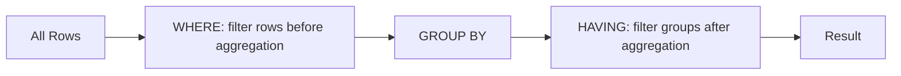

# :material-filter-variant: HAVING Clause

`HAVING` filters **groups** after aggregation. Use it when you need to apply a
condition to aggregated results (e.g., `COUNT`, `SUM`, `AVG`).

### :material-sitemap: Overview



---

## :material-pin: Syntax

```sql
SELECT group_cols, aggregate_exprs
FROM table
[WHERE row_predicate]
GROUP BY group_cols
HAVING aggregate_predicate;
```

---

## :material-magnify: Behavior

1. **Runs after aggregation** — `HAVING` is evaluated after `GROUP BY`.
2. **Aggregate-only filters** — It can reference aggregate expressions like
   `SUM(amount)` or `COUNT(*)`.
3. **Use `WHERE` for rows** — Row-level filters should go in `WHERE` to reduce
   data before grouping.
4. **Multiple conditions** — Combine conditions with `AND`/`OR` as usual.

---

## WHERE vs HAVING vs FILTER

| Clause | Applies To | Timing | Example |
|--------|------------|--------|---------|
| `WHERE` | Rows | Before aggregation | `WHERE status = 'shipped'` |
| `HAVING` | Groups | After aggregation | `HAVING SUM(amount) > 1000` |
| `FILTER` | Individual aggregates | During aggregation | `SUM(amount) FILTER (WHERE status='shipped')` |

---

## :material-flask-outline: Practical Examples

### Filter by Total Count

```sql
SELECT region, COUNT(*) AS total_orders
FROM orders
GROUP BY region
HAVING COUNT(*) > 100;
```

### Filter by Aggregate Ratio

```sql
SELECT region,
       SUM(amount) AS total_sales,
       SUM(amount) FILTER (WHERE status = 'shipped') AS shipped_sales
FROM orders
GROUP BY region
HAVING shipped_sales / total_sales > 0.9;
```

### Combine WHERE + HAVING

```sql
SELECT product, AVG(price) AS avg_price
FROM sales
WHERE sale_date >= '2024-01-01'
GROUP BY product
HAVING AVG(price) > 100;
```

---

## :material-brain: When to Use

| Scenario | Recommended Pattern |
|----------|---------------------|
| Remove groups with small counts | `HAVING COUNT(*) > n` |
| Keep only high-value segments | `HAVING SUM(amount) > threshold` |
| Apply a ratio or aggregate condition | `HAVING` with derived aggregates |
| Row-level filtering | Use `WHERE` instead |

---

> **Tip:** Prefer `WHERE` whenever possible for better performance, and
> reserve `HAVING` for aggregate conditions.
