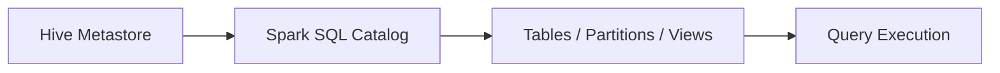

# :material-bee: Hive Context

HiveContext was an older Spark SQL entry point that enabled Hive features.
In modern Spark versions, `SparkSession` replaces it.

### :material-sitemap: Overview



---

## 📌 Example (Legacy)

```python
from pyspark.sql import HiveContext
hc = HiveContext(sc)
```

---

## 🔍 Behavior Notes

1. Deprecated in favor of `SparkSession.builder.enableHiveSupport()`.
2. Provides access to Hive UDFs and metastore.

---

## 🧠 When to Use

| Scenario | Recommendation |
|----------|----------------|
| Spark 2.x+ | Use SparkSession with Hive support |
| Legacy code | HiveContext still works |
