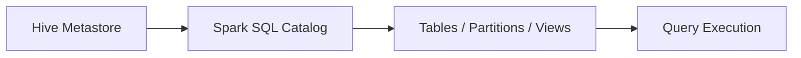

# :material-bee: Dynamic Partition Insert

Dynamic partition insert allows Spark to determine partition values from data
rather than specifying them explicitly.

### :material-sitemap: Overview



---

## 📌 Syntax

```sql
INSERT INTO TABLE sales
PARTITION (order_date)
SELECT order_id, amount, order_date
FROM staging_sales;
```

---

## 🔍 Behavior

1. Spark creates partitions based on the data values.
2. Requires `hive.exec.dynamic.partition=true` in some environments.
3. Use `dynamic` overwrite mode for partial partition replacement.

---

## 🧠 When to Use

| Scenario | Recommendation |
|----------|----------------|
| Partition values in data | Use dynamic partitions |
| Fixed partition target | Use static partition values |
