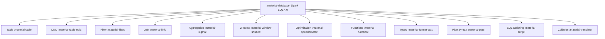
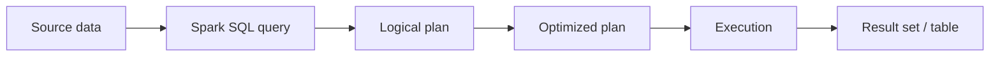

# :material-database: Spark SQL Documentation

A comprehensive learning resource for **Apache Spark 4.0 SQL** — covering syntax,
query patterns, architecture, and performance optimization. Content targets both
open-source Spark and Databricks Runtime.

!!! info "Spark 4.0"
    This documentation covers **Apache Spark 4.0** features including pipe syntax,
    VARIANT data type, SQL scripting, string collation, SQL UDFs, and ANSI mode
    as default. Pages marked **[Databricks]** use Delta Lake, Unity Catalog,
    or Databricks-only commands.

### :material-sitemap: Overview





---

## :material-new-box: What's New in Spark 4.0

| Feature | Description |
|---------|-------------|
| [Pipe Syntax `\|>`](pipe/index.md) | Chain query operations in a readable pipeline |
| [VARIANT Type](types/variant/index.md) | Semi-structured data without fixed schema |
| [String Collation](collation/index.md) | ICU-backed case/accent-insensitive comparisons |
| [SQL Scripting](control/index.md) | `BEGIN...END` blocks with variables, loops, cursors |
| [SQL UDFs](function/sql_udf/index.md) | Native scalar and table-valued functions in pure SQL |
| [Session Variables](variables/index.md) | `DECLARE` / `SET VAR` for session-scoped state |
| [EXECUTE IMMEDIATE](execute_immediate/index.md) | Dynamic SQL with parameterized queries |
| [IDENTIFIER Clause](identifier/index.md) | Safe SQL identifier templating |
| [ANSI Mode Default](config/ansi.md) | ANSI compliance enabled by default |
| [Lateral Column Alias](column/lateral_alias.md) | Reference earlier aliases in the same SELECT |
| [Migration Guide](migration/index.md) | Breaking changes from Spark 3.5 → 4.0 |

---

## :material-pin: Quick Start

```sql
-- Basic query
SELECT * FROM orders
WHERE order_date >= '2024-01-01';

-- Grouped metrics
SELECT region, SUM(amount) AS total
FROM orders
GROUP BY region;

-- Spark 4.0: Pipe syntax
FROM orders
|> WHERE order_date >= '2024-01-01'
|> SELECT region, SUM(amount) AS total
|> ORDER BY total DESC;
```

---

## :material-compass-outline: Sections

| Section | What You'll Find |
|---------|-------------------|
| [Tables & Schema](table/index.md) | Table creation, metadata, partitioning |
| [Columns & Expressions](column/index.md) | Aliases, casting, derived columns, lateral alias |
| [Data Types](types/index.md) | Type system, complex types, VARIANT, validation |
| [Data Manipulation](dml/index.md) | INSERT, UPDATE, DELETE, MERGE |
| [Filtering](filter/index.md) | WHERE, QUALIFY, TABLESAMPLE |
| [Joins](join/index.md) | Join types, strategies, hints, skew handling |
| [Aggregation](aggregation/index.md) | GROUP BY, ROLLUP, CUBE, GROUPING SETS |
| [Window Functions](window/index.md) | Window frames, ranking, navigation |
| [Pipe Syntax](pipe/index.md) | `\|>` operator for readable query pipelines |
| [SQL Scripting](control/index.md) | Variables, loops, cursors, exception handling |
| [Functions](function/index.md) | Scalar, aggregate, generator, HOF, SQL UDFs |
| [Collation](collation/index.md) | String comparison, case/accent sensitivity |
| [Optimization](optimization/index.md) | AQE, Catalyst, caching, shuffling |
| [SCD Patterns](scd/intro.md) | Slowly Changing Dimensions (Types 1–6) |
| [Time Series](timeseries/index.md) | Tumbling, hopping, sliding, gap-fill |
| [Migration Guide](migration/index.md) | Spark 3.5 → 4.0 breaking changes |

---

## :material-animation-play: Interactive Coverage Map

Click a section bar to highlight how many starter examples are available in that area.

<div id="viz-docs-overview" class="ts-viz"></div>

---

## :material-lightbulb-outline: Tips

- Use `EXPLAIN` to inspect query plans before tuning.
- Filter early to reduce data scanned (predicate pushdown).
- Prefer Delta tables for full DML support. **[Databricks]**
- ANSI mode is **on by default** in Spark 4.0 — use `try_*` functions for NULL-on-error behavior.
- Enable AQE (`spark.sql.adaptive.enabled = true`) for automatic runtime optimization.
- Use `/*+ BROADCAST(dim) */` for small dimension joins (< 10 MB).
- Use pipe syntax `|>` for complex multi-step queries to improve readability.
