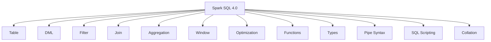
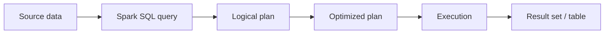

# :material-database: Spark SQL Documentation

A comprehensive learning resource for **Apache Spark 4.0 SQL** — covering syntax,
query patterns, architecture, and performance optimization. Content targets both
open-source Spark and Databricks Runtime.

!!! info "Spark 4.0"

    This documentation covers **Apache Spark 4.0** features including pipe syntax,
    VARIANT data type, SQL scripting, string collation, SQL UDFs, and ANSI mode
    as default. Pages marked **[Databricks]** use Delta Lake, Unity Catalog,
    or Databricks-only commands.

## :material-sitemap: Overview





______________________________________________________________________

## :material-new-box: What's New in Spark 4.0

| Feature                                                       | Description                                          |
| ------------------------------------------------------------- | ---------------------------------------------------- |
| [Pipe Syntax `\|>`](spark-4/pipe/index.md)                    | Chain query operations in a readable pipeline        |
| [VARIANT Type](schema-tables/types/variant/index.md)          | Semi-structured data without fixed schema            |
| [String Collation](spark-4/collation/index.md)                | ICU-backed case/accent-insensitive comparisons       |
| [SQL Scripting](scripting/index.md)                           | `BEGIN...END` blocks with variables, loops, cursors  |
| [SQL UDFs](functions/sql-udf/index.md)                        | Native scalar and table-valued functions in pure SQL |
| [Session Variables](spark-4/variables/index.md)               | `DECLARE` / `SET VAR` for session-scoped state       |
| [EXECUTE IMMEDIATE](spark-4/execute_immediate/index.md)       | Dynamic SQL with parameterized queries               |
| [IDENTIFIER Clause](spark-4/identifier/index.md)              | Safe SQL identifier templating                       |
| [ANSI Mode Default](configuration/ansi.md)                    | ANSI compliance enabled by default                   |
| [Lateral Column Alias](schema-tables/column/lateral-alias.md) | Reference earlier aliases in the same SELECT         |
| [Migration Guide](spark-4/migration/index.md)                 | Breaking changes from Spark 3.5 → 4.0                |

______________________________________________________________________

## :material-pin: Quick Start

```sql
-- Basic query
SELECT * FROM orders
WHERE order_date >= '2024-01-01';

-- Grouped metrics
SELECT region, SUM(amount) AS total
FROM orders
GROUP BY region;

-- Spark 4.0: Pipe syntax
FROM orders
|> WHERE order_date >= '2024-01-01'
|> SELECT region, SUM(amount) AS total
|> ORDER BY total DESC;
```

______________________________________________________________________

## :material-compass-outline: Sections

| Section                                                                     | What You'll Find                                                                     |
| --------------------------------------------------------------------------- | ------------------------------------------------------------------------------------ |
| :material-new-box: [Spark 4.0](spark-4/pipe/index.md)                       | Pipe syntax, collation, variables, EXECUTE IMMEDIATE                                 |
| :material-table: [Schema & Tables](schema-tables/table/index.md)            | Table creation, metadata, partitioning, columns, keys, DML                           |
| :material-format-text: [Data Types](schema-tables/types/index.md)           | Type system, complex types, VARIANT, validation                                      |
| :material-filter: [Querying, Joins & Aggregation](querying/filter/index.md) | Conditions, filtering, operators, subqueries, CTEs, NULLs, joins, GROUP BY, pivoting |
| :material-window-shutter: [Window Functions](window-functions/index.md)     | Window frames, ranking, navigation, aggregate                                        |
| :material-function: [Functions](functions/index.md)                         | Scalar, aggregate, generator, HOF, lambda, SQL UDFs                                  |
| :material-script: [SQL Scripting](scripting/index.md)                       | Variables, loops, control flow, exception handling                                   |
| :material-speedometer: [Optimization](optimization/index.md)                | AQE, Catalyst, caching, partitioning, execution plans                                |
| :material-chart-timeline: [Patterns](patterns/index.md)                     | Running totals, top-N, gaps & islands, sessionization                                |
| :material-clock-outline: [Time Series](patterns/timeseries/index.md)        | Tumbling, hopping, sliding, gap-fill windows                                         |
| :material-swap-vertical: [SCD](patterns/scd/concepts.md)                    | Slowly Changing Dimensions (Types 1–6)                                               |
| :material-database-outline: [Data Sources](data-sources/index.md)           | Parquet, Delta, JSON, CSV, JDBC, Hive, Catalog                                       |
| :material-cog: [Configuration](configuration/index.md)                      | Session config, AQE, joins, shuffle, CLI                                             |
| :material-chip: [Internals](internals/planner/query-planner.md)             | Query planner, parsing, file reader                                                  |

______________________________________________________________________

## :material-animation-play: Interactive Coverage Map

Click a section bar to highlight how many starter examples are available in that area.

<div id="viz-docs-overview" class="ts-viz"></div>

______________________________________________________________________

## :material-lightbulb-outline: Tips

- Use `EXPLAIN` to inspect query plans before tuning.
- Filter early to reduce data scanned (predicate pushdown).
- Prefer Delta tables for full DML support. **[Databricks]**
- ANSI mode is **on by default** in Spark 4.0 — use `try_*` functions for NULL-on-error behavior.
- Enable AQE (`spark.sql.adaptive.enabled = true`) for automatic runtime optimization.
- Use `/*+ BROADCAST(dim) */` for small dimension joins (< 10 MB).
- Use pipe syntax `|>` for complex multi-step queries to improve readability.
- Before shipping any query fix, check it against the [Six-Axis Quality Rubric](optimization/optimization.md#the-six-axis-quality-rubric) — logical correctness, cardinality, physical plan, shuffle, data distribution, and memory.
