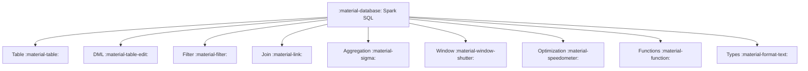
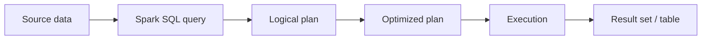

# :material-database: Spark SQL Documentation

Welcome to the Spark SQL knowledge base. This site is organized by topic areas
so you can quickly find syntax, examples, and optimization guidance.

### :material-sitemap: Overview





---

## :material-pin: Quick Start

```sql
-- Basic query
SELECT * FROM orders
WHERE order_date >= '2024-01-01';

-- Grouped metrics
SELECT region, SUM(amount) AS total
FROM orders
GROUP BY region;
```

---

## :material-compass-outline: Sections

| Section | What You'll Find |
|---------|-------------------|
| [Table](table/index.md) | Table creation and management |
| [Column](column/index.md) | Column expressions and selection |
| [Data Types](types/index.md) | Type system and casting |
| [DML](dml/index.md) | INSERT/UPDATE/DELETE/MERGE |
| [Filter](filter/index.md) | WHERE, HAVING, NULL handling |
| [Join](join/index.md) | Join types, strategies, hints |
| [Aggregation](aggregation/index.md) | GROUP BY, rollup, cube |
| [Window](window/index.md) | Window functions and frames |
| [Optimization](optimization/index.md) | Performance tuning |

---

## :material-animation-play: Interactive Coverage Map

Click a section bar to highlight how many starter examples are available in that area.

<div id="viz-docs-overview" class="ts-viz"></div>

---

## :material-brain: Tips

- Use `EXPLAIN` to inspect query plans.
- Filter early to reduce data scanned.
- Prefer Delta tables for full DML support.
