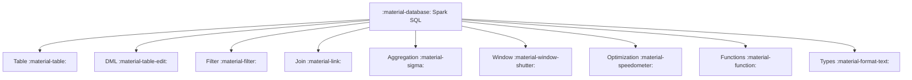
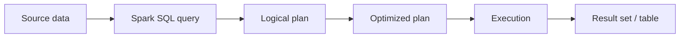

# :material-database: Spark SQL Documentation

A comprehensive learning resource for **Apache Spark 3.5 SQL** — covering syntax,
query patterns, architecture, and performance optimization. Content targets both
open-source Spark and Databricks Runtime.

!!! tip "Databricks-specific features"
    Pages and code blocks marked **[Databricks]** use Delta Lake, Unity Catalog,
    or Databricks-only commands. All other content works on any Spark 3.x deployment.

### :material-sitemap: Overview





---

## :material-pin: Quick Start

```sql
-- Basic query
SELECT * FROM orders
WHERE order_date >= '2024-01-01';

-- Grouped metrics
SELECT region, SUM(amount) AS total
FROM orders
GROUP BY region;
```

---

## :material-compass-outline: Sections

| Section | What You'll Find |
|---------|-------------------|
| [Tables & Schema](table/index.md) | Table creation, metadata, partitioning |
| [Columns & Expressions](column/index.md) | Aliases, casting, derived columns |
| [Data Types](types/index.md) | Type system, complex types, validation |
| [Data Manipulation](dml/index.md) | INSERT, UPDATE, DELETE, MERGE **[Databricks]** |
| [Filtering](filter/index.md) | WHERE, QUALIFY, TABLESAMPLE |
| [Joins](join/index.md) | Join types, strategies, hints, skew handling |
| [Aggregation](aggregation/index.md) | GROUP BY, ROLLUP, CUBE, GROUPING SETS |
| [Window Functions](window/index.md) | Window frames, ranking, navigation |
| [Optimization](optimization/index.md) | AQE, Catalyst, caching, shuffling |
| [SCD Patterns](scd/intro.md) | Slowly Changing Dimensions (Types 1–6) |
| [Time Series](timeseries/index.md) | Tumbling, hopping, sliding, gap-fill |

---

## :material-animation-play: Interactive Coverage Map

Click a section bar to highlight how many starter examples are available in that area.

<div id="viz-docs-overview" class="ts-viz"></div>

---

## :material-lightbulb-outline: Tips

- Use `EXPLAIN` to inspect query plans before tuning.
- Filter early to reduce data scanned (predicate pushdown).
- Prefer Delta tables for full DML support. **[Databricks]**
- Enable AQE (`spark.sql.adaptive.enabled = true`) for automatic runtime optimization.
- Use `/*+ BROADCAST(dim) */` for small dimension joins (< 10 MB).
