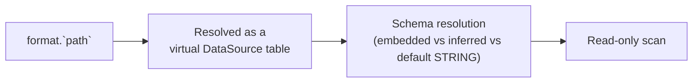

# :material-file-eye: SQL File Reader

Spark SQL can read files directly in SQL queries using the file format as a table name,
without needing to create a table or DataFrame first.

## :material-sitemap: Overview



### :material-animation-play: Interactive Visualization — Schema Resolution by Format

<div id="viz-schema-resolution" class="ts-viz"></div>

Pick a format to see whether `` format.`path`  `` gives you real column types for free, or
silently falls back to untyped `STRING` columns — a common surprise with the CSV shorthand.

## :material-pin: Syntax

```sql
SELECT * FROM format.`path`
```

| Format  | Example                                              |
| ------- | ---------------------------------------------------- |
| Parquet | `` SELECT * FROM parquet.`/path/to/file.parquet`  `` |
| CSV     | `` SELECT * FROM csv.`/path/to/file.csv`  ``         |
| JSON    | `` SELECT * FROM json.`/path/to/file.json`  ``       |
| ORC     | `` SELECT * FROM orc.`/path/to/file.orc`  ``         |
| Text    | `` SELECT * FROM text.`/path/to/file.txt`  ``        |

## :material-magnify: Behavior

1. The format name acts as a **virtual table** backed by the file.
2. **Schema resolution is format-dependent, not uniformly "inferred":**
    - Parquet/ORC read the schema embedded in the file — always fully typed.
    - JSON's shorthand infers types from the values it scans (e.g. a numeric literal becomes
        `BIGINT`), same as `spark.read.json(...)`'s default.
    - **CSV's shorthand does *not* infer types** — `inferSchema` defaults to `false`, so every
        column comes back as `STRING` named `_c0`, `_c1`, ... To get typed/named columns from
        CSV you must use `CREATE ... USING csv OPTIONS (inferSchema 'true', header 'true', ...)`
        (see Example 2) — the bare `` csv.`path`  `` shorthand alone is not enough (verified below).
3. Supports glob patterns: `` parquet.`/data/*.parquet`  ``.
4. Supports directory paths: reads all files in the directory (schemas across files must be
    compatible).
5. Read-only for the `` format.`path`  `` shorthand — attempting `INSERT INTO` against it
    resolves the target as a *table/view lookup*, not a writable file sink, so it fails with
    `[TABLE_OR_VIEW_NOT_FOUND]` rather than a dedicated "read-only" error (see Example 6). Use
    `DataFrameWriter`/`INSERT INTO` against a **registered** table, or `CREATE TABLE ... USING`
    with a path, to write.

## :material-flask-outline: Practical Examples

### :material-toy-brick: 1. Read Parquet Directly

```sql
SELECT * FROM parquet.`/data/sales/2024/`;
```

### :material-toy-brick: 2. Read CSV with Schema

```sql
CREATE OR REPLACE TEMP VIEW sales
USING csv
OPTIONS (
  path '/data/sales.csv',
  header 'true',
  inferSchema 'true',
  delimiter ','
);

SELECT * FROM sales WHERE amount > 100;
```

### :material-alert-circle-outline: 2b. CSV Shorthand Without Options — Untyped Columns

```sql
-- No header/inferSchema option available with the bare format.`path` shorthand
SELECT * FROM csv.`/data/sales.csv`;
```

```text
root
 |-- _c0: string (nullable = true)
 |-- _c1: string (nullable = true)
```

Every column is `STRING`, and names are positional (`_c0`, `_c1`, ...) — even if the first
row of the file is a header row, it is read back as ordinary data. Use Example 2's
`CREATE ... USING csv OPTIONS (...)` form whenever you need real column names/types from CSV.

### :material-toy-brick: 3. Read JSON

```sql
SELECT * FROM json.`/data/events.json`;
-- JSON's shorthand *does* infer types, e.g. numeric fields come back as BIGINT/DOUBLE

-- With options
CREATE OR REPLACE TEMP VIEW events
USING json
OPTIONS (
  path '/data/events.json',
  multiLine 'true'
);
```

### :material-toy-brick: 4. Read with Glob Pattern

```sql
SELECT * FROM parquet.`/data/logs/2024-01-*`;
```

### :material-toy-brick: 5. Create Temp View from File

```sql
CREATE OR REPLACE TEMPORARY VIEW customers
USING parquet
OPTIONS (path '/data/customers.parquet');

SELECT * FROM customers WHERE country = 'US';
```

### :material-alert-circle-outline: 6. Writing Through the Shorthand Fails

```sql
INSERT INTO parquet.`/data/customers.parquet` VALUES (99, 'test');
-- [TABLE_OR_VIEW_NOT_FOUND] The table or view `parquet`.`/data/customers.parquet`
-- cannot be found ...
```

The `` format.`path`  `` shorthand only resolves for **reads**; there is no writable path-table
counterpart to pair with it. To write to the same location, use the DataFrame API
(`df.write.parquet(path)`) or `CREATE TABLE ... USING parquet LOCATION 'path'` followed by
`INSERT INTO` against that registered table name.

## :material-brain: When to Use

| Scenario                         | Approach                                                                                 |
| -------------------------------- | ---------------------------------------------------------------------------------------- |
| Quick ad-hoc exploration         | `` SELECT * FROM format.`path`  ``                                                       |
| Repeated queries on same file    | Create a temp view with `USING`                                                          |
| CSV with real column names/types | `CREATE ... USING csv OPTIONS (header, inferSchema)` — never the bare shorthand          |
| Production pipelines             | Create managed/external table                                                            |
| Schema enforcement needed        | Use `USING` with explicit schema                                                         |
| Writing to a file path           | `DataFrameWriter` or `CREATE TABLE ... LOCATION`, not the `` format.`path`  `` shorthand |
