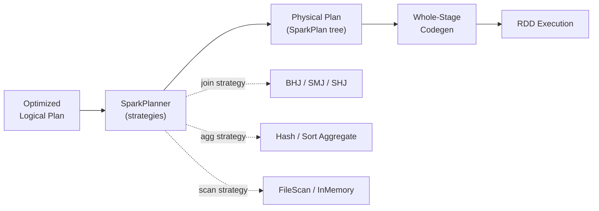

# :material-map-legend: Query Planner

The **physical planner** (`SparkPlanner`) converts an optimized *logical* plan into an
executable *physical* plan by applying a set of **strategies** — each strategy chooses a
concrete algorithm (a `SparkPlan` operator) for a logical operation. The result is a tree
of physical operators that Spark can actually run.

## :material-sitemap: Overview



Logical operators describe **what** to compute; physical operators decide **how**. A single
logical `Join` may become a `BroadcastHashJoin`, `SortMergeJoin`, or others depending on
statistics, sizes, and configuration.

### :material-animation-play: Interactive Visualization — Join Strategy Selector

<div id="viz-join-strategy" class="ts-viz"></div>

Adjust the size of each join side relative to the broadcast threshold to see which physical
join strategy the planner picks.

## :material-pin: Join Strategies

| Strategy                       | When Used                                                          | Broadcast? |
| ------------------------------ | ------------------------------------------------------------------ | ---------- |
| **Broadcast Hash Join**        | One side fits in memory (< `spark.sql.autoBroadcastJoinThreshold`) | Yes        |
| **Sort Merge Join**            | Default for large-large equi-joins                                 | No         |
| **Shuffle Hash Join**          | One side is much smaller but above broadcast threshold             | No         |
| **Broadcast Nested Loop Join** | Non-equi joins with a small table                                  | Yes        |
| **Cartesian Product**          | Cross joins (no join predicate)                                    | No         |

The planner prefers strategies roughly in this order: broadcast hash → shuffle hash →
sort merge → broadcast nested loop → cartesian, subject to size thresholds and join type
support (e.g. full outer joins cannot use a shuffle hash join).

### :material-flask-outline: Broadcast Hash Join plan

When one side is below the broadcast threshold, the planner inserts a `BroadcastExchange`
and builds an in-memory hash table — no shuffle of the large side:

```text
* BroadcastHashJoin Inner BuildRight
:- * Filter / Range              (large, streamed)
+- BroadcastExchange
   +- * Range                    (small, broadcast)
```

### :material-flask-outline: Sort Merge Join plan

With broadcast disabled (or both sides large), each side is shuffled on the join key
(`Exchange hashpartitioning(k, 200)`), sorted, then merged:

```text
* SortMergeJoin Inner
:- * Sort [k ASC]
:  +- Exchange hashpartitioning(k, 200)
+- * Sort [k ASC]
   +- Exchange hashpartitioning(k, 200)
```

Two `Exchange` + `Sort` pairs are the tell-tale signature of a sort-merge join.

## :material-pin: Aggregation Strategies

| Strategy                  | Description                                                           |
| ------------------------- | --------------------------------------------------------------------- |
| **Hash Aggregate**        | In-memory hash table; fast, memory-bound, falls back to sort on spill |
| **Sort Aggregate**        | Sort-based; handles very large groups with spilling                   |
| **Object Hash Aggregate** | For complex types (structs, arrays) not supported by hash aggregate   |

Aggregation is executed in **two phases** to minimize shuffle: a `partial_*` aggregate
runs per-partition *before* the shuffle, then a final aggregate combines the partials:

```text
* HashAggregate  (final:  count)
+- Exchange hashpartitioning(k, 200)
   +- * HashAggregate  (partial_count(1))
      +- * Range
```

### :material-animation-play: Interactive Visualization — Two-Phase Aggregation

<div id="viz-two-phase-agg" class="ts-viz"></div>

Verified with `EXPLAIN FORMATTED` on a real `COUNT(*)` query: each partition computes its
own `partial_count(1)` locally, only the small partial results cross the shuffle boundary,
and the final `HashAggregate` combines them into the answer.

## :material-flask-outline: Hint-Based Control

```sql
-- Force broadcast join
SELECT /*+ BROADCAST(small_table) */ *
FROM large_table JOIN small_table ON large_table.id = small_table.id;

-- Force sort merge join
SELECT /*+ MERGE(t1, t2) */ *
FROM t1 JOIN t2 ON t1.id = t2.id;

-- Force shuffle hash join
SELECT /*+ SHUFFLE_HASH(t1) */ *
FROM t1 JOIN t2 ON t1.id = t2.id;

-- Repartition hint
SELECT /*+ REPARTITION(10) */ * FROM large_table;
```

Inspect the chosen strategy with `EXPLAIN FORMATTED` — the top operator name
(`BroadcastHashJoin`, `SortMergeJoin`, …) confirms what the planner selected.

## :material-pin: Key Configuration

| Parameter                                       | Default | Description                                |
| ----------------------------------------------- | ------- | ------------------------------------------ |
| `spark.sql.autoBroadcastJoinThreshold`          | `10MB`  | Max size for auto-broadcast; `-1` disables |
| `spark.sql.shuffle.partitions`                  | `200`   | Number of shuffle partitions               |
| `spark.sql.adaptive.enabled`                    | `true`  | Enable Adaptive Query Execution            |
| `spark.sql.adaptive.coalescePartitions.enabled` | `true`  | Auto-coalesce small shuffle partitions     |
| `spark.sql.adaptive.skewJoin.enabled`           | `true`  | Split skewed partitions at runtime         |

!!! note "AQE can override the planner"

    With AQE enabled, the initial physical plan may change **at runtime** based on actual
    shuffle statistics — e.g. a `SortMergeJoin` becomes a `BroadcastHashJoin` once a side
    is found to be small. Look for `AdaptiveSparkPlan isFinalPlan=true` in the plan.

## :material-brain: When to Tune

| Symptom                               | Possible Fix                                           |
| ------------------------------------- | ------------------------------------------------------ |
| Slow joins on small tables            | Increase broadcast threshold or add a `BROADCAST` hint |
| Too many small output files           | Reduce shuffle partitions or enable AQE coalescing     |
| Skewed joins (one slow task)          | Enable AQE skew join optimization                      |
| OOM during aggregation                | Prefer sort aggregate / reduce partition size          |
| Unexpected `CartesianProduct` in plan | Add the missing join predicate                         |

!!! tip "Read the plan bottom-up"

    A physical plan executes from the leaves (scans) upward. `Exchange` marks a shuffle
    boundary, `BroadcastExchange` marks a broadcast, and `*` before an operator means it is
    part of a whole-stage codegen block. See [Query Parsing & Execution](query-parsing.md)
    for the full compilation pipeline.
