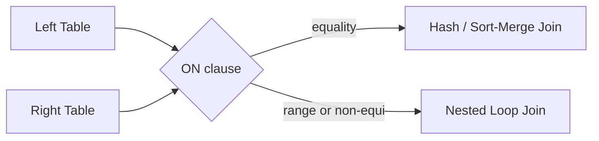

# :material-code-equal: Join Expressions in Spark SQL

A **join expression** defines how Spark matches rows between two datasets. The `ON` clause specifies the logic for joining tables, enabling powerful data combinations.


### :material-sitemap: Overview



---

## 🔹 1. Equality Join (Equi-Join)

```sql
SELECT *
FROM customers c
JOIN orders o
  ON c.id = o.customer_id;
```

*Matches rows where `id` in `customers` equals `customer_id` in `orders`.*

---

## 🔹 2. Multiple Conditions

```sql
SELECT *
FROM employees e
JOIN departments d
  ON e.dept_id = d.id
 AND e.location = d.location;
```

*Joins on more than one condition using `AND`.*

---

## 🔹 3. Non-Equality (Range) Join

```sql
SELECT *
FROM transactions t
JOIN tax_slabs s
  ON t.amount BETWEEN s.min_amount AND s.max_amount;
```

or

```sql
SELECT *
FROM A
JOIN B
  ON A.value >= B.min
 AND A.value <= B.max;
```

*Joins rows based on a range or non-equality condition.*

---

## 🔹 4. Function-Based Expression

```sql
SELECT *
FROM logs l
JOIN users u
  ON lower(l.username) = lower(u.login);
```

*Uses SQL functions in the join condition.*

---

## 🔹 5. OR Condition

```sql
SELECT *
FROM flights f
JOIN routes r
  ON f.src = r.src
  OR f.dest = r.dest;
```

*Joins rows if **either** condition matches.*

---

## 🔹 6. Cross Join (No Expression)

```sql
SELECT *
FROM A
CROSS JOIN B;
```

*Produces the Cartesian product of both tables (all combinations).*

---

## 🔹 7. USING Clause

```sql
SELECT *
FROM customers
JOIN orders
USING (id);
```

*Shortcut for equality join on columns with the same name:*

```sql
ON customers.id = orders.id
```

---

## 💡 Best Practices

- **Always use explicit `ON` conditions** (avoid just `WHERE`).
- **Group multiple conditions** with `AND` / `OR` for clarity.
- **Broadcast small tables** to optimize joins:

  ```python
  broadcast(df_small)
  ```

- **Prefer equality joins** for performance (enables hash or sort-merge joins).
- **Non-equi (range) joins** are more expensive (often use nested loop join).

---

## ✅ Summary

In Spark SQL, join expressions in the `ON` clause can be:

- **Equality** (`=`)
- **Multiple conditions** (`AND`, `OR`)
- **Range** (`BETWEEN`, `<`, `>`)
- **Function-based** (`lower()`, `concat()`, etc.)
- **Omitted** (for `CROSS JOIN`)

Use the right join expression for your data and performance needs!
