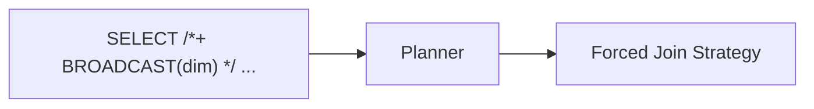

# :material-lightbulb-on: Join Hints

Join hints let you influence the physical join strategy chosen by the Spark planner.
They are expressed as inline SQL comments: `/*+ HINT_NAME(table) */`.

---

## :material-sitemap: Overview



---

## :material-table: Hint Reference

| Hint | Strategy Forced | Best When |
|------|-----------------|-----------|
| `BROADCAST(t)` | Broadcast Hash Join | One side is small (< broadcast threshold) |
| `MERGE(t)` | Sort-Merge Join | Both sides large, keys sortable |
| `SHUFFLE_HASH(t)` | Shuffle Hash Join | Both sides large, enough memory for hash table |
| `SHUFFLE_REPLICATE_NL(t)` | Shuffle-and-Replicate Nested Loop | Cross joins or non-equi joins |
| `SKEW(t)` | AQE skew split override | Known skewed keys that AQE misses |

---

## :material-pencil-outline: Syntax

```sql
-- Single table hint
SELECT /*+ BROADCAST(dim) */ f.order_id, dim.region
FROM fact_orders f
JOIN dim_region dim ON f.region_id = dim.id;

-- Multiple hints in one query
SELECT /*+ BROADCAST(dim), SKEW('orders') */ *
FROM orders
JOIN dim_region dim ON orders.region_id = dim.id;

-- Hint on aliased table
SELECT /*+ MERGE(a) */ *
FROM large_table_a a
JOIN large_table_b b ON a.id = b.id;
```

---

## :material-sort-numeric-ascending: Hint Precedence

When both sides carry conflicting hints, the planner resolves them in this priority order:

1. `BROADCAST`
2. `MERGE`
3. `SHUFFLE_HASH`
4. `SHUFFLE_REPLICATE_NL`

Higher-priority hints win. If the same hint appears on both sides, Spark picks the build side based on join type and relative sizes.

---

## :material-magnify: Behavior Notes

1. Hints are **best-effort** — if a hint is physically impossible (e.g., table too large to broadcast), Spark falls back to its normal strategy selection with a warning.
2. Use `EXPLAIN` to verify that your hint was honoured.
3. Broadcast joins require the build side to fit in executor memory; exceeding the limit causes OOM.
4. The `SKEW` hint is only recognised in Databricks Runtime; in open-source Spark, AQE handles skew automatically.

---

## :material-code-tags: Verify with EXPLAIN

```sql
EXPLAIN
SELECT /*+ BROADCAST(dim) */ f.order_id, dim.region
FROM fact_orders f
JOIN dim_region dim ON f.region_id = dim.id;
-- Look for: BroadcastHashJoin in the plan output
```
