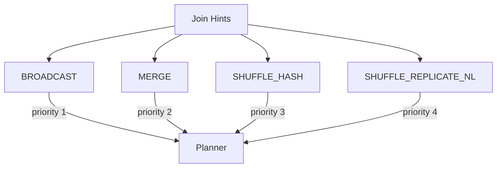

# :material-lightbulb-on: Spark SQL Join Hint Operators

Spark SQL provides **join strategy hints** to override the planner's automatic choice.
Each hint is placed in a `/*+ ... */` comment immediately after `SELECT`.

---

## :material-sitemap: Overview



---

## :material-rocket-launch: BROADCAST

Broadcasts the hinted table to every executor so no shuffle is needed for the larger side.

```sql
-- Broadcast the small dimension table
SELECT /*+ BROADCAST(dim) */
    f.order_id, dim.region
FROM fact_orders f
JOIN dim_region dim ON f.region_id = dim.id;

-- Broadcast a subquery alias
SELECT /*+ BROADCAST(active_customers) */
    t.transaction_id, active_customers.name
FROM transactions t
JOIN (SELECT id, name FROM customers WHERE active = true) active_customers
    ON t.customer_id = active_customers.id;
```

!!! tip
    Broadcasts below `spark.sql.autoBroadcastJoinThreshold` (default 10 MB) happen automatically.
    Use this hint when the table is small but above the threshold.

---

## :material-sort: MERGE

Forces a Sort-Merge Join regardless of table sizes.

```sql
-- Force sort-merge join for two large tables
SELECT /*+ MERGE(orders) */
    o.order_id, p.payment_status
FROM orders o
JOIN payments p ON o.order_id = p.order_id;
```

!!! note
    Both join keys must be **sortable**. If not, Spark falls back to Shuffle Hash Join.

---

## :material-shuffle-variant: SHUFFLE_HASH

Forces a Shuffle Hash Join. Both sides are shuffled, then the smaller (build) side is hashed in memory.

```sql
-- Force shuffle hash join
SELECT /*+ SHUFFLE_HASH(dim) */
    f.sale_id, dim.category
FROM fact_sales f
JOIN dim_product dim ON f.product_id = dim.product_id;
```

!!! warning
    The build side (hinted table) must fit in executor memory. If it does not, the task may OOM.

---

## :material-grid: SHUFFLE_REPLICATE_NL

Replicates one side and uses a nested loop. Use for **cross joins** or **non-equi conditions** when no other strategy applies.

```sql
-- Cross join with all date combinations
SELECT /*+ SHUFFLE_REPLICATE_NL(dates) */
    p.product_id, dates.date_value
FROM products p
CROSS JOIN dates;

-- Non-equi join: match transactions to applicable tax slabs
SELECT /*+ SHUFFLE_REPLICATE_NL(tax_slabs) */
    t.transaction_id, t.amount, s.tax_rate
FROM transactions t
JOIN tax_slabs s ON t.amount BETWEEN s.min_amount AND s.max_amount;
```

!!! warning
    Output size is `N × M` rows. Avoid for large inputs.

---

## :material-pencil-outline: Hint Precedence

When both sides of a join carry conflicting hints, the planner resolves them in order:

| Priority | Hint |
|----------|------|
| 1 (highest) | `BROADCAST` |
| 2 | `MERGE` |
| 3 | `SHUFFLE_HASH` |
| 4 (lowest) | `SHUFFLE_REPLICATE_NL` |

---

## :material-code-tags: Verify the Plan

```sql
EXPLAIN
SELECT /*+ BROADCAST(dim) */ f.order_id, dim.region
FROM fact_orders f
JOIN dim_region dim ON f.region_id = dim.id;
-- Expected: BroadcastHashJoin in plan output
```
