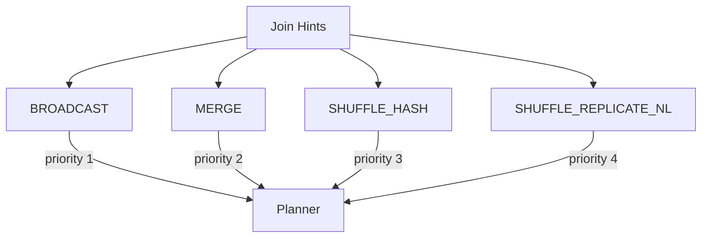

# :material-lightbulb-on: Spark SQL Join Hint Operators

Spark SQL provides several **join strategy hints** to influence the physical execution plan of joins. These hints allow you to guide Spark in choosing the most efficient join strategy for your data and workload.

Supported join hints include:

- `BROADCAST`
- `MERGE`
- `SHUFFLE_HASH`
- `SHUFFLE_REPLICATE_NL`

Each hint instructs Spark to use the specified strategy for the hinted relation when performing a join.


### :material-sitemap: Overview



---

## :material-rocket-launch: BROADCAST Hint

The `BROADCAST` hint tells Spark to broadcast the specified table to all worker nodes, enabling a broadcast join. This can significantly speed up joins when one table is small enough to fit in memory.

> **Note:** Spark will prioritize a broadcast join for the hinted table, even if its size exceeds the `spark.sql.autoBroadcastJoinThreshold` configuration.

**Example:**

```sql
SELECT /*+ BROADCAST(r) */ *
FROM records r
JOIN src s
  ON r.key = s.key
```

In this example, the `records` table (`r`) will be broadcasted to all nodes.

---

## :material-pencil-outline: Hint Precedence

When multiple join hints are specified on both sides of a join, Spark applies the following precedence:

1. **BROADCAST**
2. **MERGE**
3. **SHUFFLE_HASH**
4. **SHUFFLE_REPLICATE_NL**

If both sides use the same hint (e.g., both use `BROADCAST` or `SHUFFLE_HASH`), Spark selects the build side based on the join type and the relative sizes of the relations.

---

## :material-bookshelf: References

- [Spark SQL Join Hints Documentation](https://spark.apache.org/docs/latest/sql-ref-syntax-qry-select-hints.html)
- [Spark SQL Performance Tuning](https://spark.apache.org/docs/latest/sql-performance-tuning.html)

---

Enhance your Spark SQL queries by leveraging join hints to optimize performance for your specific data scenarios!
