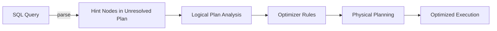

# :material-lightbulb-on: Hint Resolution

How Spark SQL parses, validates, and applies join hints at plan time.

---

## :material-sitemap: Resolution Pipeline



---

## :material-cog-outline: How Resolution Works

1. **Parse** — The SQL parser identifies `/*+ ... */` comment blocks and attaches `UnresolvedHint` nodes to the logical plan.
2. **Analyse** — `ResolveHints` resolves table names and aliases inside hint arguments against the current plan scope.
3. **Optimise** — Rules in the Catalyst optimizer (`EliminateResolvedHint`, `PreferSortMergeJoin`, etc.) propagate hints to the relevant join node.
4. **Physical plan** — `JoinSelection` reads hint flags on each join node and picks the forced strategy when the hint is applicable.

---

## :material-sort-numeric-ascending: Precedence Rules

| Priority | Hint | Strategy |
|----------|------|----------|
| 1 (highest) | `BROADCAST` | Broadcast Hash Join |
| 2 | `MERGE` | Sort-Merge Join |
| 3 | `SHUFFLE_HASH` | Shuffle Hash Join |
| 4 (lowest) | `SHUFFLE_REPLICATE_NL` | Shuffle-and-Replicate Nested Loop |

When conflicting hints appear on both sides of a join, the higher-priority hint wins. If both sides carry the same hint (e.g., both `BROADCAST`), Spark selects the build side by join type and relative size.

---

## :material-flask-outline: Examples

```sql
-- BROADCAST hint — resolved to dim_region alias
SELECT /*+ BROADCAST(dim) */ f.order_id, dim.region
FROM fact_orders f
JOIN dim_region dim ON f.region_id = dim.id;

-- MERGE hint — forces sort-merge join
SELECT /*+ MERGE(a) */ a.id, b.value
FROM large_a a
JOIN large_b b ON a.id = b.id;

-- Hint on a subquery alias
SELECT /*+ BROADCAST(sub) */ t.id, sub.name
FROM transactions t
JOIN (SELECT id, name FROM customers WHERE active = true) sub
    ON t.customer_id = sub.id;
```

---

## :material-alert-circle: Hint Inapplicability

A hint is silently ignored (with a `WARN` log) when:

| Condition | Hint ignored |
|-----------|-------------|
| `BROADCAST` on a table too large to fit in memory | Falls back to SMJ or SHJ |
| `MERGE` on non-sortable join keys | Falls back to SHJ or BNLJ |
| Hint table name does not match any relation | Entire hint block ignored |
| Full outer join with `BROADCAST` | Not supported; falls back to SMJ |

---

## :material-code-tags: Verify Resolution with EXPLAIN

```sql
EXPLAIN FORMATTED
SELECT /*+ BROADCAST(dim) */ f.order_id, dim.region
FROM fact_orders f
JOIN dim_region dim ON f.region_id = dim.id;
```

In the output, look for:

- `BroadcastHashJoin` — hint was applied.
- `SortMergeJoin` — hint was ignored; check logs for the reason.
- `Hints` section in the formatted plan lists all hint nodes that were parsed.

---

## :material-magnify: Behavior Notes

1. Hint resolution is **case-insensitive** for table/alias names.
2. Using the wrong alias (e.g., `/*+ BROADCAST(fact_orders) */` when the alias is `f`) will cause the hint to be silently discarded.
3. Multiple hints in one comment block are applied independently: `/*+ BROADCAST(dim), SKEW('orders') */`.
4. In Databricks Runtime, unresolved hints produce a warning rather than an error.
