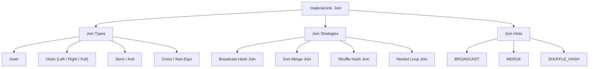
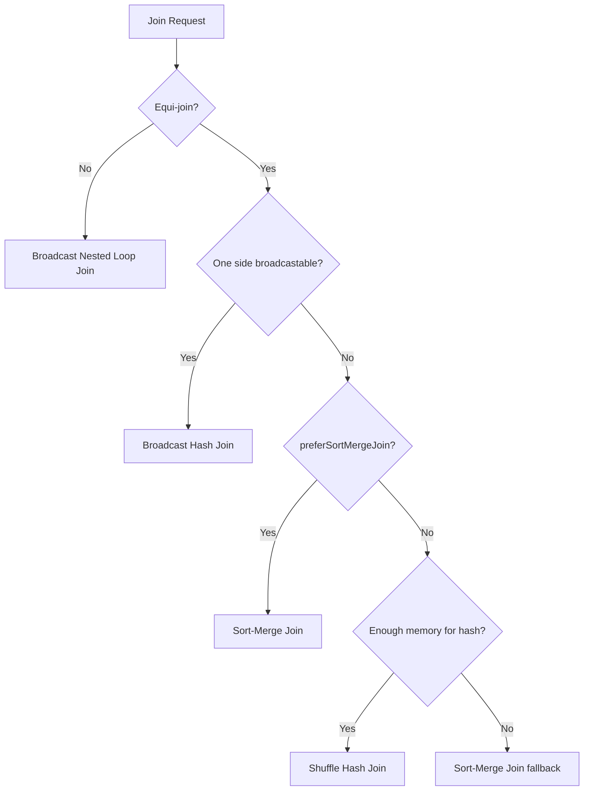

# :material-link: Join Overview

Joins combine rows from two datasets based on a matching condition.
Spark supports multiple join **types**, **strategies**, and **hints**.

---

## :material-view-grid: In This Section

| Topic | What You Will Learn |
|-------|---------------------|
| [Join Types](types/index.md) | INNER, LEFT/RIGHT/FULL OUTER, LEFT SEMI, LEFT ANTI, CROSS, Non-Equi |
| [Join Expressions](expression.md) | ON clause, USING, range, function-based, OR conditions |
| [Join Strategies](strategy/index.md) | BHJ, SMJ, SHJ, BNLJ, SSMJ, SRNLP — when Spark picks each |
| [Join Hints](hints/index.md) | BROADCAST, MERGE, SHUFFLE_HASH, SHUFFLE_REPLICATE_NL, SKEW |
| [Join Issues](issues/index.md) | Duplicate columns, skewed keys, data explosion, null traps |
| [Join Optimization](optimization/index.md) | Broadcast, repartition, early filtering, AQE, skew handling |

---

## :material-sitemap: Architecture



---

## :material-table: Join Type Quick Reference

| Join Type | Left Rows | Right Rows | NULLs | Typical Use |
|-----------|:---------:|:----------:|:-----:|-------------|
| `INNER JOIN` | Matched | Matched | None | Combine related tables |
| `LEFT JOIN` | All | Matched | Right cols | Keep all left rows |
| `RIGHT JOIN` | Matched | All | Left cols | Keep all right rows |
| `FULL OUTER JOIN` | All | All | Both sides | Reconcile two datasets |
| `LEFT SEMI JOIN` | Matched | Not returned | None | Existence filter |
| `LEFT ANTI JOIN` | Unmatched | Not returned | None | Find missing records |
| `CROSS JOIN` | All | All (×) | None | Generate combinations |
| Non-equi (`<`, `BETWEEN`) | Conditional | Conditional | None | Range matching |

---

## :material-flask-outline: Basic Example

```sql
-- Equi join: orders enriched with customer name
SELECT o.order_id, o.amount, c.name AS customer_name
FROM orders o
JOIN customers c
    ON o.customer_id = c.customer_id;

-- Broadcast hint for small dimension table
SELECT /*+ BROADCAST(c) */
    o.order_id, o.amount, c.name AS customer_name
FROM orders o
JOIN customers c
    ON o.customer_id = c.customer_id;
```

---

## :material-cog-outline: Strategy Selection (Quick Reference)



---

## :material-check-all: Performance Checklist

| Check | Action |
|-------|--------|
| Small dimension table? | Add `BROADCAST` hint or lower `autoBroadcastJoinThreshold` |
| Large fact-fact join? | Ensure both sides are partitioned on join key |
| Skewed join key? | Enable AQE skew join or use salting |
| Non-equi condition? | Pre-filter to reduce rows before the join |
| Slow join plan? | Run `EXPLAIN` and inspect join strategy in the plan |

---

## :material-magnify: Behavior Notes

1. Nulls in join key columns are **never equal** under standard `=`; use `<=>` for null-safe matching.
2. `LEFT SEMI JOIN` is more efficient than `INNER JOIN` when only left-side columns are needed.
3. Broadcast joins are fast but require the small side to fit in executor memory.
4. AQE (`spark.sql.adaptive.enabled = true`) can dynamically switch strategies at runtime.
5. Use `EXPLAIN FORMATTED` to verify which join strategy Spark has chosen.

---

## :material-code-tags: EXPLAIN Tip

```sql
EXPLAIN FORMATTED
SELECT o.order_id, c.name
FROM orders o
JOIN customers c
    ON o.customer_id = c.customer_id;
-- Look for: BroadcastHashJoin, SortMergeJoin, ShuffledHashJoin in the plan
```
