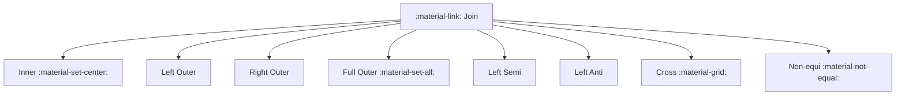

# :material-link: Join Overview

Joins combine rows from two datasets based on a matching condition.
Spark supports multiple join **types**, **strategies**, and **hints**.


### :material-sitemap: Overview



---

## 📌 Join Types

| Join Type | Description |
|-----------|-------------|
| Inner | Keep matching rows only |
| Left / Right | Keep all rows from one side |
| Full | Keep all rows from both sides |
| Left Semi | Keep rows with a match (left only) |
| Left Anti | Keep rows without a match (left only) |
| Cross | Cartesian product |

---

## 🧪 Example

```sql
SELECT o.order_id, c.customer_name
FROM orders o
JOIN customers c
ON o.customer_id = c.customer_id;
```

---

## 🔍 Behavior Notes

1. Join condition should be selective to avoid large shuffles.
2. Broadcast joins are faster for small dimension tables.
3. Join hints can influence strategy selection.

---

### Related Guides

- [Join Types](types/index.md)
- [Join Strategies](strategy/index.md)
- [Join Hints](hints/index.md)
- [Join Issues](issues/index.md)
- [Join Optimization](optimization/index.md)
