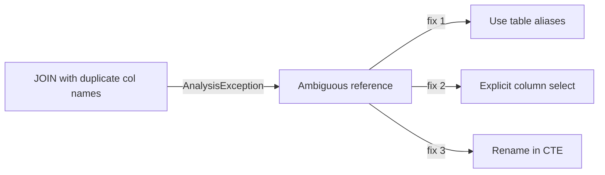

# :material-alert-circle: Duplicate Columns in Joins

When two joined tables contain columns with the same name, Spark can throw
**ambiguous column** errors or silently overwrite one column.


### :material-sitemap: Overview



---

## :material-pin: Common Symptoms

- `AnalysisException: Reference 'id' is ambiguous`
- Unexpected values after `SELECT *`

---

## :material-flask-outline: Practical Fixes

### 1) Use Table Aliases

```sql
SELECT a.id AS order_id, b.id AS customer_id
FROM orders a
JOIN customers b
ON a.customer_id = b.id;
```

### 2) Select Explicit Columns

```sql
SELECT o.order_id, o.amount, c.customer_name
FROM orders o
JOIN customers c
ON o.customer_id = c.id;
```

### 3) Rename Columns Before Join

```sql
WITH c AS (
  SELECT id AS customer_id, name FROM customers
)
SELECT o.order_id, c.customer_id
FROM orders o
JOIN c ON o.customer_id = c.customer_id;
```

---

## :material-brain: When to Use

| Scenario | Recommended Pattern |
|----------|---------------------|
| Avoid ambiguity | Use aliases and explicit selects |
| Prepare for star select | Rename columns in CTE |
