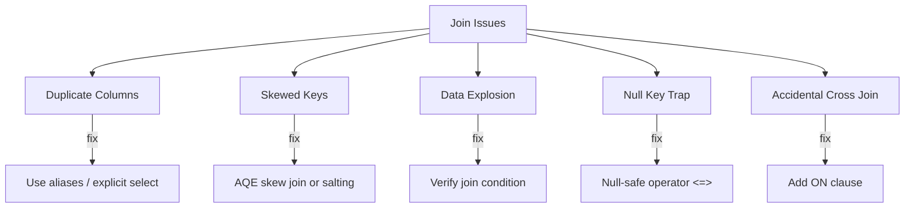

# :material-alert-circle: Join Issues

Common problems that surface as slow performance, incorrect results, or runtime errors.

---

## :material-sitemap: Overview



---

## :material-table: Issue Reference

| Issue | Symptom | Fix |
|-------|---------|-----|
| Duplicate column names | `AnalysisException: Reference 'id' is ambiguous` | Use table aliases or explicit column list |
| Skewed join keys | One task runs for hours; others finish quickly | Enable AQE skew join or use salting |
| Data explosion | Output rows >> input rows | Check join condition — likely a many-to-many |
| Null key trap | Rows silently excluded from join | Use `<=>` or `COALESCE(key, '')` in ON clause |
| Accidental cross join | Job hangs; enormous shuffle | Ensure every `JOIN` has an `ON` clause |

---

## :material-magnify: Duplicate Columns

See [Duplicate Columns](column_duplicate.md) for full examples and fixes.

```sql
-- Wrong: ambiguous 'id'
SELECT id FROM orders JOIN customers ON orders.customer_id = customers.id;

-- Correct: qualified references
SELECT orders.order_id, customers.id AS customer_id
FROM orders JOIN customers ON orders.customer_id = customers.id;
```

---

## :material-scale-unbalanced: Skewed Keys

When a small number of join key values hold the majority of rows, their executor partitions become bottlenecks.

```sql
-- Diagnose skew: find the most frequent join keys
SELECT customer_id, COUNT(*) AS cnt
FROM orders
GROUP BY customer_id
ORDER BY cnt DESC
LIMIT 10;
```

**Fixes:**

```sql
-- AQE handles skew automatically (Spark 3.x default)
SET spark.sql.adaptive.enabled = true;
SET spark.sql.adaptive.skewJoin.enabled = true;

-- Manual skew hint (Databricks Runtime)
SELECT /*+ SKEW('orders', 'customer_id') */
    o.order_id, c.name
FROM orders o
JOIN customers c ON o.customer_id = c.customer_id;
```

---

## :material-arrow-expand-all: Data Explosion

Output is far larger than either input — a sign of an unintended many-to-many join.

```sql
-- Diagnose: count distinct keys on both sides
SELECT COUNT(DISTINCT order_id) FROM orders;   -- should be unique
SELECT COUNT(DISTINCT order_id) FROM payments; -- may have duplicates

-- Fix: deduplicate before joining
WITH deduped_payments AS (
    SELECT order_id, MAX(payment_status) AS payment_status
    FROM payments
    GROUP BY order_id
)
SELECT o.order_id, dp.payment_status
FROM orders o
JOIN deduped_payments dp ON o.order_id = dp.order_id;
```

---

## :material-null: Null Key Trap

Standard equality (`=`) never matches NULL, so rows with NULL join keys are silently dropped.

```sql
-- Silently drops rows where customer_id IS NULL on either side
SELECT * FROM orders o JOIN customers c ON o.customer_id = c.customer_id;

-- Null-safe join: treats NULL = NULL as true
SELECT * FROM orders o JOIN customers c ON o.customer_id <=> c.customer_id;

-- Alternative: COALESCE sentinel
SELECT * FROM orders o
JOIN customers c ON COALESCE(o.customer_id, -1) = COALESCE(c.customer_id, -1);
```

---

## :material-magnify: Behavior Notes

1. Validate join key nullability with `DESCRIBE TABLE` before writing the join.
2. Use `EXPLAIN` to confirm the join strategy and spot accidental cross joins (`CartesianProduct` in the plan).
3. Broadcast small tables to avoid shuffle — this also prevents skew from propagating to the large side.
