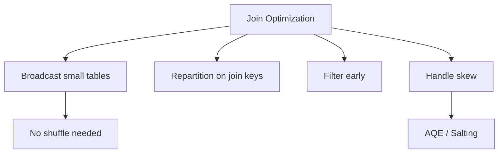

# :material-speedometer: Join Optimization

Join performance depends on data size, key distribution, and the selected
physical strategy. This guide highlights practical tuning tips.


### :material-sitemap: Overview



---

## 📌 Key Levers

| Lever | Effect |
|-------|--------|
| Broadcast small tables | Avoid shuffle |
| Repartition on join keys | Co-locate matching keys |
| Filter early | Reduce input size |
| Handle skew | Split skewed keys |

---

## 🧪 Practical Example

```sql
SELECT /*+ BROADCAST(dim) */
  f.order_id, dim.region
FROM fact_orders f
JOIN dim_region dim
ON f.region_id = dim.id
WHERE f.order_date >= '2024-01-01';
```

---

## 🔍 Behavior Notes

1. Spark chooses strategies automatically but hints can override.
2. Skewed keys can cause single-task bottlenecks.
3. Use `EXPLAIN` to confirm join plans.

---

### Related Guides

- [Join Hints](../hints/index.md)
- [Join Strategies](../strategy/index.md)
