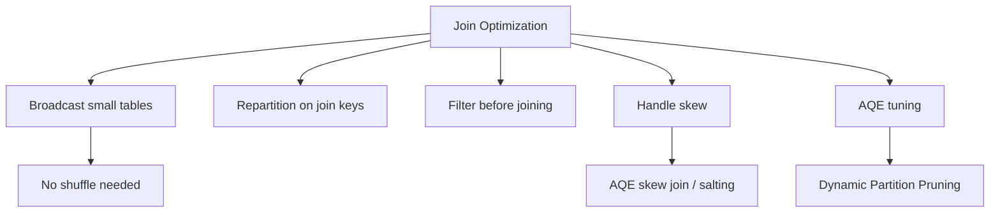

# :material-speedometer: Join Optimization

Practical techniques for making joins faster and more reliable.

---

## :material-sitemap: Overview



---

## :material-table: Optimization Levers

| Technique | When to Apply | Expected Benefit |
|-----------|---------------|-----------------|
| Broadcast small dimension | One side < 10 MB (or < broadcast threshold) | Eliminates shuffle entirely |
| Repartition on join key | Repeated joins on the same key | Co-locates data; avoids repeated shuffles |
| Filter early | Large table with selective predicate | Reduces rows before shuffle |
| AQE skew join | Uneven key distribution | Splits skewed partitions dynamically |
| AQE coalesce | Many small post-join partitions | Reduces task count and scheduling overhead |
| Z-ordering / clustering | Delta tables joined on a range column | Prunes files before shuffle |
| Dynamic Partition Pruning | Star-schema queries | Skips irrelevant fact-table partitions |

---

## :material-rocket-launch: Broadcast Small Tables

```sql
-- Explicit hint
SELECT /*+ BROADCAST(dim) */
    f.order_id, dim.region
FROM fact_orders f
JOIN dim_region dim ON f.region_id = dim.id
WHERE f.order_date >= '2024-01-01';

-- Or raise the threshold for a session
SET spark.sql.autoBroadcastJoinThreshold = 52428800; -- 50 MB
```

---

## :material-filter-outline: Filter Before Joining

Push selective filters as close to the source as possible so fewer rows enter the join.

```sql
-- Good: filter inside CTE before joining
WITH recent_orders AS (
    SELECT * FROM orders WHERE order_date >= '2024-01-01'
)
SELECT r.order_id, c.name
FROM recent_orders r
JOIN customers c ON r.customer_id = c.customer_id;
```

---

## :material-cog-outline: AQE Configuration

```sql
-- Enable AQE (default in Spark 3.x and Databricks)
SET spark.sql.adaptive.enabled = true;

-- Allow AQE to fix skewed join partitions
SET spark.sql.adaptive.skewJoin.enabled = true;
SET spark.sql.adaptive.skewJoin.skewedPartitionFactor = 5;
SET spark.sql.adaptive.skewJoin.skewedPartitionThresholdInBytes = 268435456; -- 256 MB

-- Coalesce small post-shuffle partitions
SET spark.sql.adaptive.coalescePartitions.enabled = true;
SET spark.sql.adaptive.advisoryPartitionSizeInBytes = 67108864; -- 64 MB
```

---

## :material-chart-bar: Dynamic Partition Pruning

For star-schema queries, Spark can prune fact-table partitions at runtime based on the dimension filter.

```sql
-- DPP kicks in automatically when:
-- 1. The fact table is partitioned on the join key
-- 2. The dimension table has a selective filter

SELECT f.order_id, d.region
FROM fact_orders f                         -- partitioned by region_id
JOIN dim_region d ON f.region_id = d.id
WHERE d.country = 'US';                    -- prunes non-US region partitions in fact table
```

---

## :material-flask-outline: Repartition on Join Key

```sql
-- Repartition both sides on the join key before a repeated join
-- (Useful when multiple downstream joins share the same key)
CREATE OR REPLACE TEMP VIEW orders_by_customer AS
SELECT * FROM orders DISTRIBUTE BY customer_id;

CREATE OR REPLACE TEMP VIEW customers_by_id AS
SELECT * FROM customers DISTRIBUTE BY customer_id;

SELECT o.order_id, c.name
FROM orders_by_customer o
JOIN customers_by_id c ON o.customer_id = c.customer_id;
```

---

## :material-magnify: Behavior Notes

1. Run `EXPLAIN FORMATTED` to confirm the join strategy Spark chose.
2. AQE can switch a planned Sort-Merge Join to a Broadcast Hash Join at runtime if one side turns out small.
3. Avoid UDFs in join conditions — they prevent predicate pushdown and force nested loop joins.
4. Partition your fact tables on frequently joined keys to enable Dynamic Partition Pruning.
5. `spark.sql.shuffle.partitions` (default 200) is the starting point; AQE will coalesce it down.
