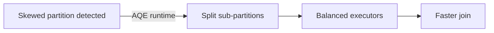

# :material-scale-unbalanced: Adaptive Query Execution (AQE) in Spark

Adaptive Query Execution (AQE) is a powerful suite of runtime optimization features introduced in Spark 3.0 and enabled by default. One of its key capabilities is the automatic optimization of joins involving skewed datasets.

### :material-sitemap: Overview

## How AQE Handles Skewed Joins

AQE primarily optimizes **Sort Merge Joins** where one dataset is skewed and the other is not. The process works as follows:

1. **Partitioning**: Both input datasets are partitioned based on the join key.
2. **Shuffle Statistics**: After the shuffle phase, Spark collects statistics on the size of each partition.
3. **Skew Detection**: Using these statistics and configurable parameters, AQE identifies skewed partitions.
4. **Partition Splitting**: Skewed partitions are split into smaller partitions.
5. **Join Execution**: Each smaller partition is joined with a corresponding partition from the non-skewed dataset.

This dynamic approach helps balance the workload and improves overall query performance.

## Key Configuration Parameters

The following Spark configuration parameters control skewed join optimization in AQE:

- **`spark.sql.adaptive.skewJoin.enabled`**  
  *Type*: Boolean  
  *Default*: `true`  
  Enables or disables skewed join optimization.

- **`spark.sql.adaptive.skewJoin.skewedPartitionFactor`**  
  *Type*: Integer  
  *Default*: `5`  
  Determines how much larger a partition must be (relative to the median partition size) to be considered skewed.

- **`spark.sql.adaptive.skewJoin.skewedPartitionThresholdInBytes`**  
  *Type*: Bytes (default: `256MB`)  
  Sets the minimum size for a partition to be considered skewed.

A partition is considered **skewed** if **both** of the following are true:

- `partition size > skewedPartitionFactor × median partition size`
- `partition size > skewedPartitionThresholdInBytes`

## Limitations

- AQE cannot handle **Full Outer Joins** for skewed data.
- It cannot handle skewness in **both** input datasets.
- For **Left Joins** (Outer, Semi, Anti), AQE can only handle skew in the left dataset.
- For **Right Joins**, it can only handle skew in the right dataset.

> **Tip:** For advanced join optimization, also explore techniques like **Broadcast Hash Join** and **Salted Sort Merge Join**.
