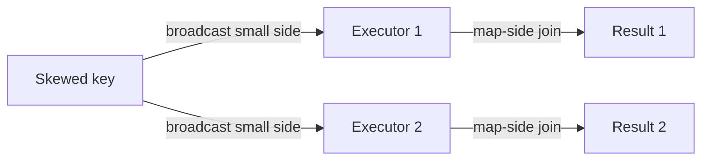

# :material-scale-unbalanced: BMPJ (Broadcast Map-side Join)

BMPJ is a skew-join pattern that handles skewed keys by broadcasting the small
side and processing skewed partitions on the map side.


### :material-sitemap: Overview



---

## 📌 When It Helps

| Scenario | Why It Helps |
|----------|--------------|
| Highly skewed keys | Avoid single reducer bottlenecks |
| Small dimension table | Broadcast keeps join local |

---

## 🧪 Example Pattern

```sql
SELECT /*+ BROADCAST(dim) */
  f.*, dim.attr
FROM fact f
JOIN dim ON f.key = dim.key;
```

---

## 🔍 Notes

1. This is a pattern, not a distinct SQL syntax.
2. Requires the broadcast side to fit in memory.

---

## 🧠 When to Use

| Scenario | Recommendation |
|----------|----------------|
| Severe skew + small dimension | Use broadcast join |
| Large both sides | Use salting or AQE |
