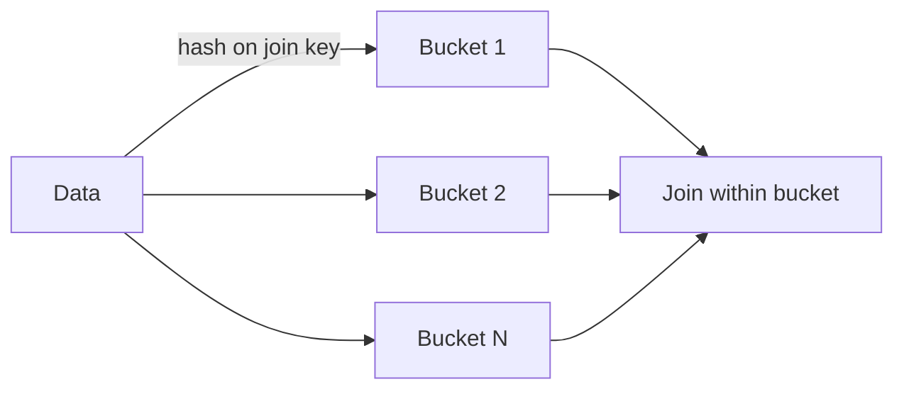

# :material-scale-unbalanced: Skew Join Using Bucketing

When dealing with skewed data in join operations, performance can degrade due to uneven data distribution. Bucketing is an effective technique to mitigate this issue.


### :material-sitemap: Overview



## What is Bucketing?

Bucketing divides your data into a fixed number of buckets based on the hash of a specified column (often the join key). Each bucket contains a subset of the data, helping to distribute records more evenly across partitions.

## How to Use Bucketing

If your system supports bucketing (such as Hive on Hadoop or bucketed tables in Spark), you can:

1. **Define Buckets:** Choose a column (typically the join key) and specify the number of buckets.
2. **Create Bucketed Tables:** Store your data in bucketed tables.
3. **Perform Joins:** When joining two bucketed tables on the bucketed column, Spark or Hive can efficiently match corresponding buckets, reducing data shuffling and improving performance.

## Example (Spark SQL)

```sql
CREATE TABLE users_bucketed
USING parquet
CLUSTERED BY (user_id) INTO 8 BUCKETS
AS SELECT * FROM users;

CREATE TABLE orders_bucketed
USING parquet
CLUSTERED BY (user_id) INTO 8 BUCKETS
AS SELECT * FROM orders;

SELECT *
FROM users_bucketed u
JOIN orders_bucketed o
ON u.user_id = o.user_id;
```

## Benefits

- **Reduces Data Skew:** Evenly distributes data, minimizing skew in join operations.
- **Improves Performance:** Less data shuffling and more parallelism during joins.
- **Scalable:** Works well with large datasets.

> **Tip:** Choose the number of buckets carefully based on your data size and cluster resources.
