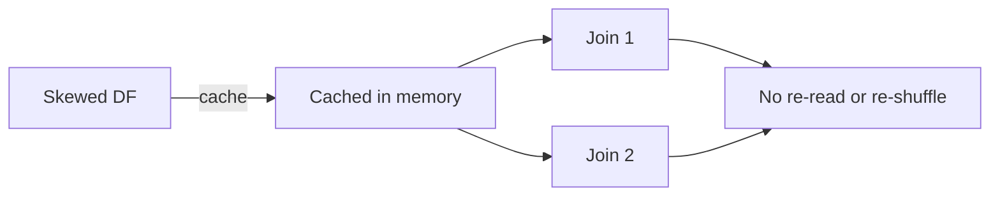

# :material-scale-unbalanced: Caching for Skewed Joins

Caching can help when the same skewed dataset is reused in multiple joins or
transformations.


### :material-sitemap: Overview



---

## :material-pin: Strategy

1. Cache the skewed dataset after filtering.
2. Broadcast or repartition as needed.
3. Reuse cached data across joins.

---

## :material-flask-outline: Example

```sql
CACHE TABLE filtered_orders;
SELECT /*+ BROADCAST(dim) */ *
FROM filtered_orders o
JOIN dim_customer dim ON o.customer_id = dim.id;
```

---

## :material-brain: When to Use

| Scenario | Recommendation |
|----------|----------------|
| Reused skewed dataset | Cache after filters |
| One-time join | Skip caching |
