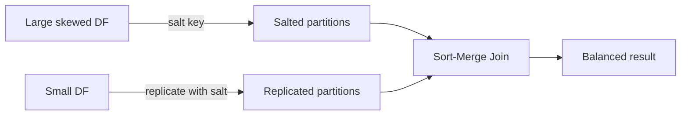

# :material-scale-unbalanced: Skewed Data Handling with Salted Sort Merge Join

The **Sort Merge Join (SMJ)** is a robust approach for handling joins, especially under resource constraints. However, when dealing with **skewed datasets**—where one side of the join has highly imbalanced key distribution—standard join strategies can lead to performance bottlenecks. The **Salted Sort Merge Join** technique addresses this challenge effectively.


### :material-sitemap: Overview



## Why Use Salted Sort Merge Join?

- **Efficient for Skewed Joins:** Ideal when joining a large, skewed dataset with a smaller, non-skewed dataset, especially when executor memory is limited.
- **Beyond Broadcast Hash Join:** Enables left joins where the smaller dataset could be broadcasted, but broadcast hash join is not feasible due to skew.
- **Control Join Strategy:** To ensure Spark uses Sort Merge Join, disable broadcast joins by setting:

    ```shell
    spark.sql.autoBroadcastJoinThreshold=-1
    ```

## How Salted Sort Merge Join Works

1. **Salting the Skewed Dataset:**
     - Add a new column (e.g., `salt_key`) to the skewed dataset.
     - For each record, assign a random value from a predefined range to the `salt_key`.

2. **Iterative Join Process:**
     - For each value in the salt key range:
         - Filter the skewed dataset for the current salt key.
         - Join this filtered subset with the unsalted dataset.
         - Collect the partial join result.
     - Combine all partial results using the `UNION` operator to produce the final joined output.

3. **Alternative Approach:**
     - For each salt key value:
         - Enrich the non-skewed dataset by adding the current salt key value to a new `salt` column.
     - Combine all enriched datasets using `UNION` to form a salt-enriched version of the non-skewed dataset.
     - Join the salted skewed dataset with the salt-enriched non-skewed dataset for the final result.

## Limitations

- **No Full Outer Join:** Salted Sort Merge Join does **not** support full outer joins.
- **Single-Side Skew Handling:** Can only handle skewness on one side:
    - **Left Joins (Outer, Semi, Anti):** Skew must be in the left dataset.
    - **Right Joins:** Skew must be in the right dataset.
- **Not for Dual-Skew:** Cannot handle skewness on both input datasets.

---

**Summary:**  
Salted Sort Merge Join is a powerful technique for handling skewed joins in Spark, especially when broadcast joins are not suitable. By introducing a salt key and partitioning the join workload, it helps distribute data more evenly and improves performance for large, imbalanced datasets.
