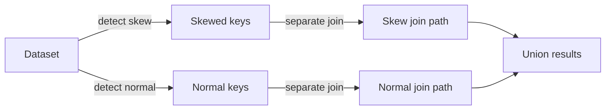

# :material-scale-unbalanced: Skewed Data?

Data skew happens when a few keys in your join/groupBy/aggregation have disproportionately more rows than others.

Example:

SELECT customer_id, COUNT(*)
FROM transactions
GROUP BY customer_id;

👉 If 1 customer has 10M transactions, while most have ~100, Spark will put that skewed key into one task, creating a straggler.

🔹 Handling Skew in Spark SQL
1. Salting (Key Randomization)

Duplicate skewed keys into multiple buckets by adding a random salt.

-- Step 1: Salt the skewed key
SELECT t.*, CONCAT(customer_id, '_', CAST(FLOOR(RAND() * 10) AS INT)) AS salted_id
FROM transactions t;

Then join/group by salted_id.
Later, aggregate results back on customer_id.

2. Map-side Skew Join Hint

Spark SQL supports skew hints to optimize joins.

SELECT /*+ SKEW(t) */ *
FROM transactions t
JOIN customers c
  ON t.customer_id = c.id;

👉 Spark will split skewed keys into multiple partitions automatically.

3. Broadcast Join (Small Table)

If one side of the join is small, avoid shuffle skew:

SELECT /*+ BROADCAST(customers) */ *
FROM transactions t
JOIN customers c
  ON t.customer_id = c.id;

4. Adaptive Query Execution (AQE) Skew Join Handling

From Spark 3.x, AQE can automatically detect and handle skewed partitions.

SET spark.sql.adaptive.enabled = true;
SET spark.sql.adaptive.skewJoin.enabled = true;
SET spark.sql.adaptive.skewJoin.skewedPartitionFactor = 5;
SET spark.sql.adaptive.skewJoin.skewedPartitionThresholdInBytes = 64MB;

👉 Spark splits large skewed partitions into smaller ones at runtime.

5. Repartition / Bucketing

Repartition data more evenly on the join key:

CREATE TABLE transactions_bucketed
USING parquet
CLUSTERED BY (customer_id) INTO 32 BUCKETS;

This ensures skewed keys distribute better.

🔹 Quick Comparison
Method	When to Use	Notes
Salting	Extreme skew on a few keys	Manual, works well but needs re-aggregation
SKEW hint	Large tables with known skew	Spark does partition splitting
Broadcast join	One side small (<10MB-100MB)	Avoids shuffle
AQE Skew Handling	Spark 3+ with adaptive enabled	Automatic, best option
Bucketing / Repartitioning	ETL pipelines with known skew	Preprocessing heavy but efficient

✅ Summary:
In Spark SQL, skewed data can be handled using salting, skew hints, broadcast joins, AQE adaptive handling, or bucketing. Best approach is AQE + hints, but if skew is extreme → add salting.

### :material-sitemap: Overview

