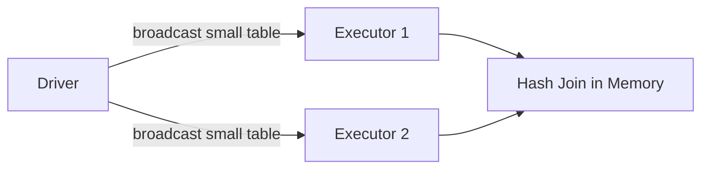
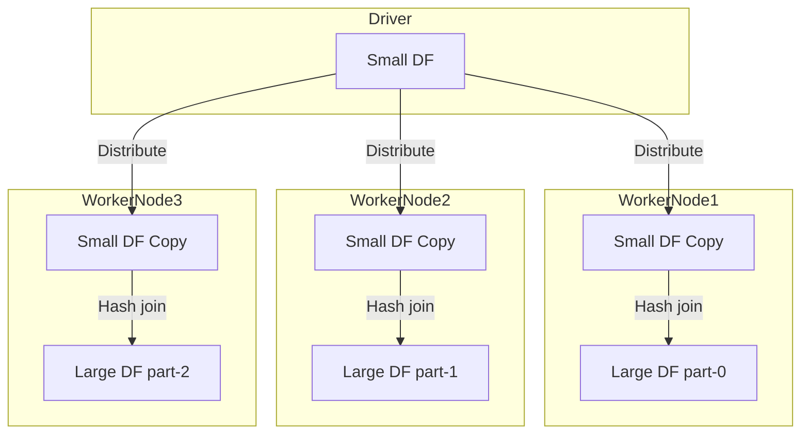

# :material-cog-transfer: Broadcast Hash Join

Broadcast Hash Join is a Spark join strategy optimized for scenarios where **one of the datasets is small enough to fit into memory**. It avoids the costly shuffle operation required by Shuffle Hash Join by broadcasting the smaller dataset to all worker nodes, enabling efficient, parallel joins.


### :material-sitemap: Overview



---

## Why Use Broadcast Hash Join?

- **Minimizes Data Shuffling:** Only the small dataset is broadcast; the large dataset remains partitioned, reducing network I/O.
- **Efficient for Skewed Data:** Ideal when joining a large table with a much smaller one.
- **Common in Practice:** Spark automatically chooses this strategy when the size of one relation is below a configurable threshold.

---

## How It Works

1. **Broadcast:** The entire small dataset is sent to every executor node.
2. **Hash Table Creation:** Each executor builds a hash table on the join key from the small dataset.
3. **Join Execution:** Executors iterate over their partition of the large dataset, probing the hash table for matches.

> **No shuffling** of the large dataset occurs, and parallelism is preserved.

---

## Key Properties

- **Threshold:** Controlled by `spark.sql.autoBroadcastJoinThreshold` (default: 10 MB).
- **Supported Joins:** All join types except **full outer joins** (i.e., supports inner, left, and right joins).
- **Join Condition:** Only supported for equality (`=`) joins.
- **Memory Requirement:** The broadcasted dataset must fit in the memory of each executor and the driver.
- **Network Intensive:** Large broadcasts can cause network congestion or out-of-memory errors.
- **Immutability:** Once broadcasted, the small dataset cannot be modified.

---

## Visual Flow



---

## Best Practices & Considerations

- **Broadcast Size:** Ensure the broadcasted dataset is well below the threshold to avoid memory issues.
- **Explicit Broadcast:** Use the `BROADCAST` hint to force broadcast joins when appropriate.
- **Immutability:** Changes to the broadcasted dataset after broadcasting are not reflected on executors.

---

## Example: SQL Syntax

```sql
SELECT /*+ BROADCAST(small_df) */
  *
FROM small_df
JOIN large_df
  ON small_df.id = large_df.id
```

**Execution Steps:**

1. Broadcast `small_df` to all executors.
2. Build a hash table on `id` from `small_df`.
3. Each executor probes the hash table with its partition of `large_df`.

---

> **Note:** Broadcast relations are distributed among executors using the BitTorrent protocol for efficiency.

---

**Summary:**  
Broadcast Hash Join is a powerful strategy for joining large and small datasets efficiently in Spark, provided the small dataset fits in memory. Use it to minimize shuffling and speed up your joins!
