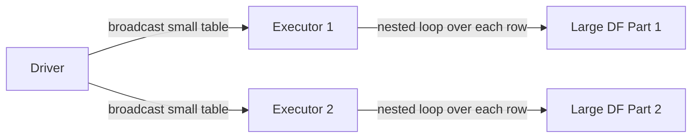
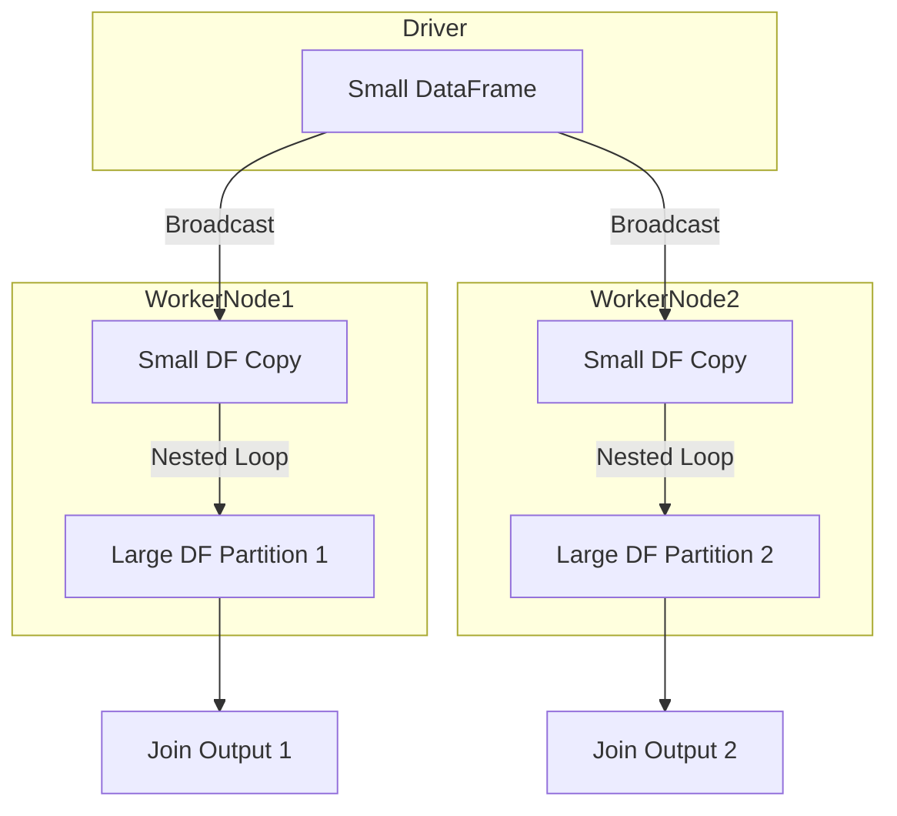

# :material-cog-transfer: Broadcast Nested Loop Join (BNLJ)

BNLJ is Spark's fallback join strategy for **non-equi joins** and **cross joins** where hash-based strategies cannot be applied.

---

## :material-sitemap: Overview



---

## :material-cog-outline: When Spark Uses BNLJ

| Trigger | Example |
|---------|---------|
| Non-equi join condition | `ON a.amount > b.min_amount` |
| `CROSS JOIN` (no predicate) | `FROM a CROSS JOIN b` |
| `OR` condition in join | `ON a.id = b.id OR a.code = b.code` |
| `BROADCAST` hint on a non-equi join | `/*+ BROADCAST(dim) */` with `<`, `LIKE`, `!=` |

---

## :material-refresh: How It Works

1. **Broadcast** — The smaller DataFrame is serialized and sent to every executor.
2. **Nested loop** — Each executor iterates over every row of its local partition of the large DataFrame. For each large-table row, it iterates over every row of the broadcast copy and evaluates the join condition.
3. **Emit** — Rows where the condition evaluates to `true` are included in the result.

The time complexity is **O(N × M)** per executor, making this strategy expensive for large inputs.

---

## :material-sitemap: Execution Diagram



---

## :material-flask-outline: Examples

```sql
-- Non-equi range join (amount must fall within a slab)
SELECT t.transaction_id, t.amount, s.tax_rate
FROM transactions t
JOIN tax_slabs s
    ON t.amount BETWEEN s.min_amount AND s.max_amount;

-- Date overlap join
SELECT a.event_id, b.campaign_id
FROM events a
JOIN campaigns b
    ON a.event_date BETWEEN b.start_date AND b.end_date;

-- CROSS JOIN (all combinations)
SELECT p.product_id, r.region_name
FROM products p
CROSS JOIN regions r;
```

---

## :material-alert-circle: Performance Notes

| Concern | Detail |
|---------|--------|
| Cost | O(N × M) per executor — avoid for large inputs |
| OOM risk | Broadcast side must fit in executor memory |
| No sort required | Neither side needs to be sorted |
| Join types | Supports all except full outer join (when broadcast side is the right table) |

!!! warning
    BNLJ can cause out-of-memory errors and very long run times on large datasets.
    Pre-filter both sides aggressively before a non-equi join.

---

## :material-magnify: Behavior Notes

1. AQE does **not** convert BNLJ to a cheaper strategy — it only optimises equi-joins.
2. For range joins on large datasets, consider the `RANGE_JOIN` hint (Databricks) or bucketing both sides by range boundaries.
3. Use `EXPLAIN` to confirm BNLJ is chosen; look for `BroadcastNestedLoopJoin` in the plan.
