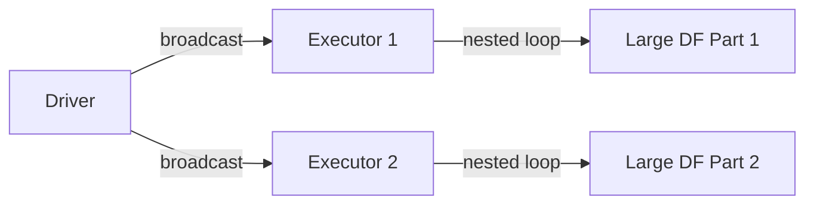
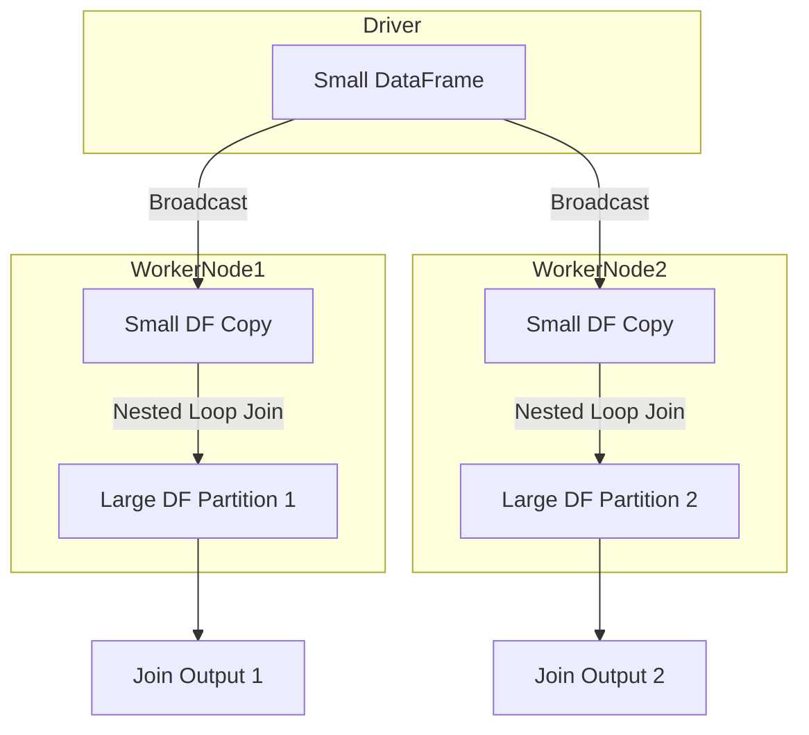

# :material-cog-transfer: Broadcast Nested Loop Join (BNLJ)?

This join type:

1. Is used when no join keys are present or when Spark cannot use hash/sort joins.
2. Broadcasts the smaller DataFrame (typically the left one) to all worker nodes.
3. Each executor scans the larger DataFrame (right side) and applies the join logic for every row of the broadcasted small table — hence, a nested loop.

### :material-sitemap: Overview

## :material-cog-outline:️ When Spark Uses BNLJ

1. Cross joins (without predicates)
2. Join conditions with `non-equi logic` (e.g., <, !=, LIKE, BETWEEN)
3. Explicit use:  `JOIN HINT /*+ BROADCAST(df) */`

## Flowchart

`Explanation:`

1. Driver broadcasts the small DataFrame to all executors.
2. Each executor performs:

   - For each row in the broadcasted DataFrame:
     - For each row in the local partition of the large DataFrame:  
       - Evaluate the join condition (can be any expression, not just equality).
3. Matched pairs are returned as result.
