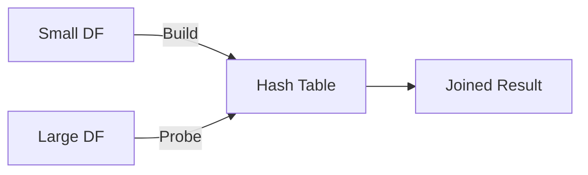
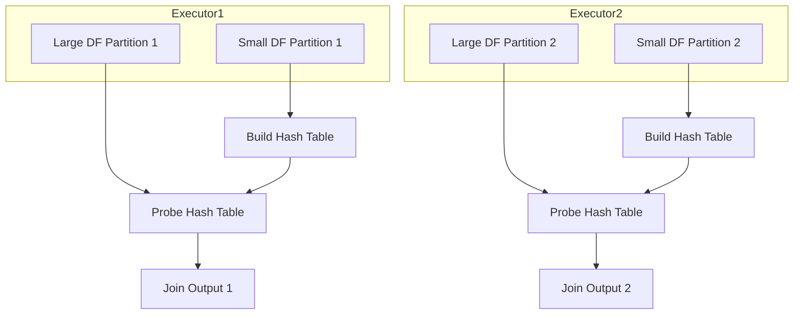

# :material-cog-transfer: Hash Join in Spark

A **hash join** is a highly efficient join strategy in Spark, especially for large datasets. It works by building a hash table from one side of the join (typically the smaller DataFrame) and then streaming the other side to find matching rows.

### :material-sitemap: Overview

---

## :material-puzzle-outline: How Hash Join Works

1. **Build Phase:**  
    Spark constructs a hash table using the *join key* from the smaller DataFrame.
2. **Probe Phase:**  
    The larger DataFrame is scanned, and each row is matched against the hash table.
3. **Output:**  
    Rows with matching keys are joined and emitted as output.

> :material-lightning-bolt: **Note:** Hash Join is only supported for *equality joins* (`=` condition).

---

## :material-office-building-cog:️ Hash Join in Spark: Node-Level Strategy

- Hash join operates **per node** in a Spark cluster.
- Each node joins its local partitions:
  1. Build a hash table from the *small table* using the join key.
  2. Loop over the *large table* and match rows using the hashed join key.

---

## :material-star: Variants of Hash Join in Spark

| Type                  | When Used                                         | Build Side                |
|-----------------------|---------------------------------------------------|---------------------------|
| **Broadcast Hash Join** | When one side is small enough to broadcast        | Broadcast (small) side    |
| **Shuffle Hash Join**   | When both sides are large; Spark shuffles data   | Smaller side (post-shuffle)|

---

## :material-check-circle-outline: Requirements for Hash Join

- **Join condition:** Must be *equality only* (`colA = colB`)
- **Supported join types:** `inner`, `left outer`, `right outer`, `semi`, `anti`

---

## :material-refresh: Execution Flow

1. **Build Phase:**  
    Hash table is built from the smaller DataFrame on the join key.
2. **Probe Phase:**  
    Each row from the larger DataFrame probes the hash table to find matches.
3. **Emit:**  
    Matching rows are output.

---

---

> :material-lightbulb-outline: **Tip:**  
> Use Broadcast Hash Join when one DataFrame is small enough to fit in memory. For larger datasets, Spark automatically chooses Shuffle Hash Join or other strategies.
