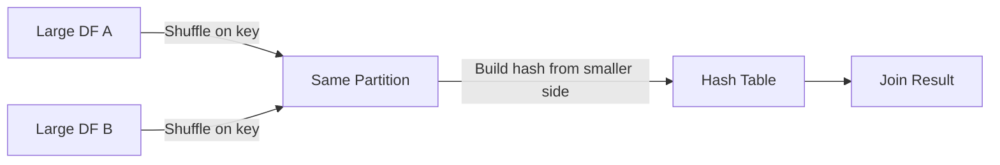

# :material-shuffle: Shuffle Hash Join in Spark

A **Shuffle Hash Join (SHJ)** is a fundamental join strategy in Apache Spark, used when both datasets are large and cannot be broadcasted. It is specifically designed for equi-joins (joins using the `=` operator).


### :material-sitemap: Overview



---

## When is Shuffle Hash Join Used?

- **Both sides are large:** Neither dataset is small enough to broadcast.
- **Broadcast is not possible:** Exceeds the broadcast threshold.
- **Equi-join keys:** Join keys must support equality comparison (`=`).

---

## How Does Shuffle Hash Join Work?

Shuffle Hash Join operates in two main phases:

### 1. **Shuffle Phase**

- Both datasets are **shuffled** across the cluster based on the join key.
- Rows with the same join key are sent to the same partition (executor node).

### 2. **Hash Join Phase**

- The **smaller side** (post-shuffle) is used to build an in-memory **hash table**.
- The larger side is streamed and matched against the hash table within each partition.

> **Note:** Sorting is **not required** within partitions for Shuffle Hash Join.

---

## Key Characteristics

- **Supported Join Types:** All join types except `FULL OUTER JOIN`.
- **Join Condition:** Only supports `=` (equi-join).
- **Join Keys:** Do **not** need to be sortable.
- **Resource Usage:** Involves both **shuffling** (network I/O) and **hashing** (memory/computation).
- **Hash Table:** Built from the smaller side after shuffling.

---

## Example

```sql
SELECT *
FROM df1
JOIN df2
    ON df1.id = df2.id
```

---

## Performance Tips

- **Prefer Broadcast Hash Join:** When one side is < 10MB.
- **Use Join Hints:** e.g., `/*+ BROADCAST(df) */` to force broadcast join when appropriate.
- **Optimize Shuffle Hash Join:**
  - Ensure **balanced partitioning** to avoid data skew.
  - Tune `spark.sql.autoBroadcastJoinThreshold` for optimal performance.

---

## Summary Table

| Feature                | Shuffle Hash Join         |
|------------------------|--------------------------|
| Join Type              | Equi-join (`=`) only     |
| Supported Joins        | All except full outer    |
| Sorting Required       | No                       |
| Broadcast Used         | No                       |
| Memory Usage           | Medium to High           |
| Network Usage          | High (due to shuffle)    |

---

## Additional Notes

- Shuffle Hash Join is generally **more expensive** than Broadcast Hash Join due to the cost of shuffling and building hash tables.
- Always monitor memory usage and partition sizes to avoid out-of-memory errors.
