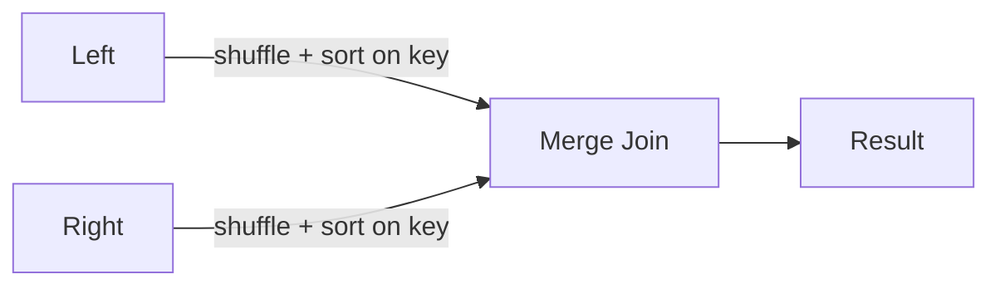
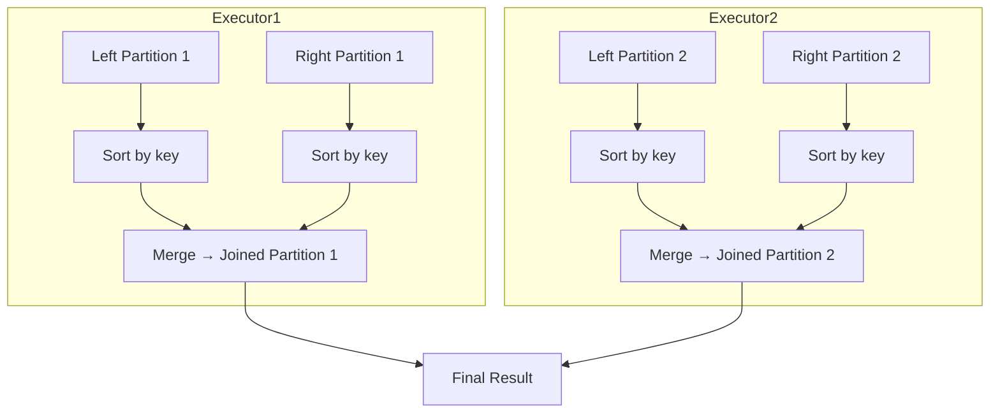

# :material-cog-transfer: Sort-Merge Join

Sort-Merge Join (SMJ) is the **default fallback** join strategy in Spark for large datasets where broadcast is not feasible. It requires join keys to be sortable.

---

## :material-sitemap: Overview



---

## :material-cog-outline: How It Works

1. **Shuffle Phase** — Both DataFrames are shuffled so rows with the same join key land in the same partition.
2. **Sort Phase** — Each partition is sorted by the join key independently on each executor.
3. **Merge Phase** — Spark walks both sorted partitions in tandem, emitting matched rows — an O(N) scan with no hash table needed.

---

## :material-table: Properties

| Property | Value |
|----------|-------|
| Join condition | Equi-join only (`=`) |
| Key sortability | Required |
| Supported join types | All (inner, left, right, full, semi, anti) |
| Memory pressure | Low — no in-memory hash table |
| Network cost | High — full shuffle of both sides |
| Default strategy | Yes (when broadcast not applicable) |

---

## :material-flask-outline: Examples

```sql
-- SMJ chosen automatically for two large tables
SELECT o.order_id, p.payment_status
FROM orders o
JOIN payments p ON o.order_id = p.order_id;

-- Force SMJ with hint
SELECT /*+ MERGE(orders) */ o.order_id, p.payment_status
FROM orders o
JOIN payments p ON o.order_id = p.order_id;

-- Disable broadcast to guarantee SMJ
SET spark.sql.autoBroadcastJoinThreshold = -1;
SELECT o.order_id, c.name
FROM orders o
JOIN customers c ON o.customer_id = c.customer_id;
```

---

## :material-cog-outline: Configuration

```sql
-- Disable broadcast joins entirely (force SMJ)
SET spark.sql.autoBroadcastJoinThreshold = -1;

-- Prefer SMJ over Shuffle Hash Join (default: true)
SET spark.sql.join.preferSortMergeJoin = true;

-- Number of shuffle partitions (tune for data volume)
SET spark.sql.shuffle.partitions = 400;
```

---

## :material-check-circle-outline: Sort-Merge vs Shuffle Hash Join

| Factor | Sort-Merge Join | Shuffle Hash Join |
|--------|-----------------|-------------------|
| Memory | Low | Medium–High |
| Sort required | Yes | No |
| Key sortability | Required | Not required |
| Full outer join | Supported | Not supported |
| Best when | Keys are well-distributed, memory is tight | One side is much smaller post-shuffle |

---

## :material-sitemap: Execution Diagram



---

## :material-magnify: Behavior Notes

1. SMJ is the safest choice for large-to-large joins because it has bounded memory usage.
2. AQE can dynamically convert a planned SMJ to BHJ at runtime if one side turns out to be small.
3. If keys are heavily skewed, enable `spark.sql.adaptive.skewJoin.enabled = true` to split hot partitions.
4. For pre-sorted or bucketed tables, Spark can skip the sort phase — use `CLUSTER BY` or bucketing to pre-arrange data.
