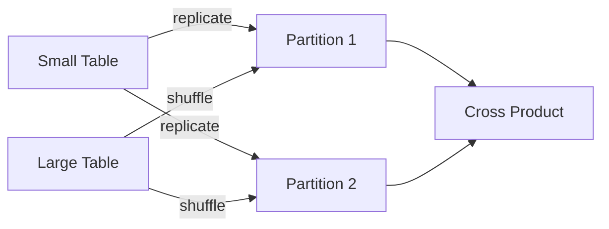

# :material-cog-transfer: Shuffle-and-Replicate Nested Loop Join

> **Use Case:**  
> Efficient for *cross joins* (Cartesian product) when no join condition exists.


### :material-sitemap: Overview



---

## How It Works

- **Replication:**  
    Spark replicates the entire dataset from one side (usually the smaller table) to all partitions of the other side.

- **Shuffling:**  
    The larger dataset is shuffled across the cluster, ensuring every partition receives the replicated data.

- **Computation:**  
    Each partition computes the Cartesian product between its chunk and the replicated data.

---

## :material-alert:️ Considerations

- **Performance:**  
    This strategy is **extremely expensive**:  
  - Output size is `n × m` rows (where `n` and `m` are input sizes).
  - High memory and network usage.

- **When to Use:**  
  - Only when necessary (e.g., true cross joins).
  - Avoid for large datasets.

---

## Example

```sql
SELECT * FROM tableA CROSS JOIN tableB
```

---

> **Tip:**  
> Prefer other join strategies when possible. Use with caution!
