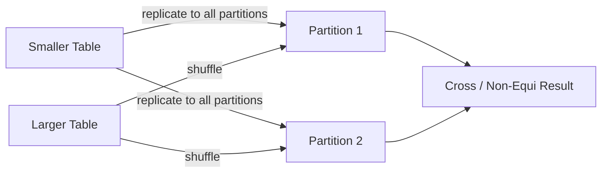

# :material-cog-transfer: Shuffle-and-Replicate Nested Loop Join (SRNLJ)

Used for **cross joins** or **non-equi joins** when neither side is small enough to broadcast.

---

## :material-sitemap: Overview



---

## :material-cog-outline: How It Works

| Phase | Description |
|-------|-------------|
| **Shuffle** | The larger table is shuffled across the cluster. |
| **Replicate** | The entire smaller table is replicated to every partition of the larger table. |
| **Nested Loop** | Within each partition, every row of the smaller replicated copy is compared against every row of the larger partition. |
| **Output** | Rows satisfying the condition are emitted. |

Output size: **N × M rows** (Cartesian product if no condition, or filtered subset for non-equi).

---

## :material-flask-outline: Examples

```sql
-- Cross join: all product × region combinations
SELECT p.product_id, r.region_name, p.base_price
FROM products p
CROSS JOIN regions r;

-- Non-equi join: match events to overlapping campaigns
SELECT e.event_id, c.campaign_id
FROM events e
JOIN campaigns c
    ON e.event_date >= c.start_date AND e.event_date <= c.end_date;

-- Force SRNLJ with hint
SELECT /*+ SHUFFLE_REPLICATE_NL(dates) */
    t.transaction_id, dates.fiscal_period
FROM transactions t
CROSS JOIN fiscal_dates dates;
```

---

## :material-table: SRNLJ vs BNLJ

| Factor | SRNLJ | BNLJ |
|--------|-------|------|
| Small-side handling | Replicated via shuffle | Broadcast by driver |
| Memory requirement | Lower (replicated in parts) | High (must fit in executor RAM) |
| Network cost | High (shuffle + replication) | High (broadcast) |
| When used | Both sides too large to broadcast | One side small enough to broadcast |
| Non-equi support | Yes | Yes |

---

## :material-alert-circle: Performance Warnings

!!! warning
    SRNLJ is **extremely expensive**. Output is up to N × M rows. Use only when:

    - A true Cartesian product is required (e.g., generating date × dimension combos).
    - Both sides are too large to broadcast.

    Always apply aggressive filters before the join to minimise input sizes.

---

## :material-magnify: Behavior Notes

1. Triggered by `CROSS JOIN`, or by any non-equi join where broadcast is not possible.
2. Can also be forced with the `SHUFFLE_REPLICATE_NL` hint.
3. AQE cannot optimise this strategy after the fact — reduce data volume before the join.
4. For large range joins, the `RANGE_JOIN` hint (Databricks) partitions the range space efficiently and is far cheaper.
