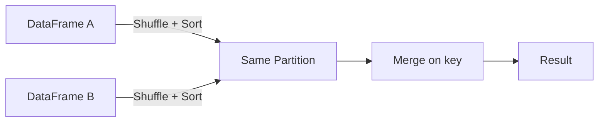
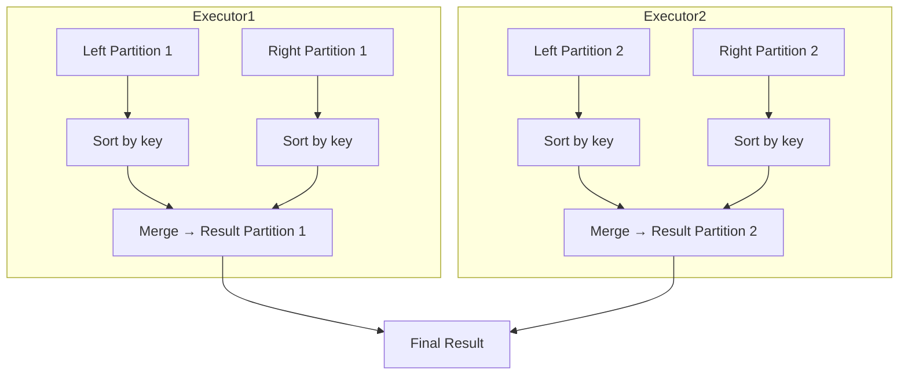

# :material-cog-transfer: Shuffle Sort-Merge Join (SSMJ)

The Shuffle Sort-Merge Join is the **most general distributed join strategy** — it works for all join types and all large-to-large joins where keys are sortable. It is also the name used in Spark's physical plan output.

---

## :material-sitemap: Overview



---

## :material-cog-outline: How It Works

| Phase | Description |
|-------|-------------|
| **Shuffle** | Both DataFrames are partitioned by hash of the join key so matching keys land in the same executor. |
| **Sort** | Within each partition, both sides are sorted by the join key. |
| **Merge** | A single-pass merge walk emits rows where keys match — no hash table needed. |

---

## :material-table: Properties

| Property | Value |
|----------|-------|
| Join condition | Equi-join (`=`) only |
| Key sortability | Required |
| Supported join types | All (inner, left, right, full, semi, anti) |
| Memory pressure | Low — streaming merge, no hash table |
| Network cost | High — full shuffle of both sides |
| Default | Yes (Spark 3.x default over Shuffle Hash Join) |

---

## :material-flask-outline: SQL Examples

```sql
-- SSMJ is chosen automatically for two large equi-joins
SELECT o.order_id, r.return_reason
FROM orders o
JOIN returns r ON o.order_id = r.order_id;

-- Force with MERGE hint
SELECT /*+ MERGE(o) */ o.order_id, r.return_reason
FROM orders o
JOIN returns r ON o.order_id = r.order_id;

-- Disable preference to allow Shuffle Hash Join instead
SET spark.sql.join.preferSortMergeJoin = false;
```

---

## :material-cog-outline: Configuration

```sql
-- Prefer SSMJ over SHJ (default: true)
SET spark.sql.join.preferSortMergeJoin = true;

-- Disable broadcast joins to force SSMJ
SET spark.sql.autoBroadcastJoinThreshold = -1;

-- Set shuffle partitions for the merge phase
SET spark.sql.shuffle.partitions = 400;
```

---

## :material-compare: SSMJ vs Broadcast Hash Join

| Factor | SSMJ | Broadcast Hash Join |
|--------|------|---------------------|
| Memory | Low | High (broadcast side in RAM) |
| Network | High (full shuffle) | Low (only small side travels) |
| Full outer join | Supported | Not supported |
| Key sortability | Required | Not required |
| Best when | Both sides large | One side small (< threshold) |

---

## :material-sitemap: Execution Diagram



---

## :material-magnify: Behavior Notes

1. AQE can convert a planned SSMJ to a Broadcast Hash Join at runtime if one side is discovered to be small after filtering.
2. Pre-bucketing both tables on the join key with the same number of buckets eliminates the shuffle and sort phases entirely.
3. `EXPLAIN` output will show `SortMergeJoin` (not `ShuffleSortMergeJoin`) — they refer to the same strategy.
