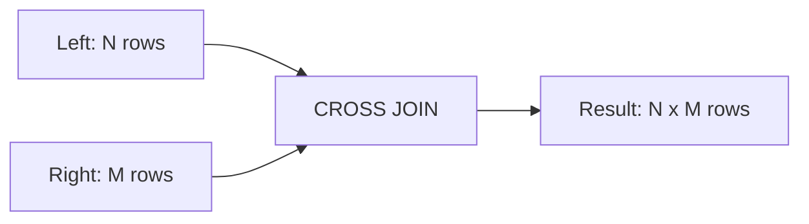
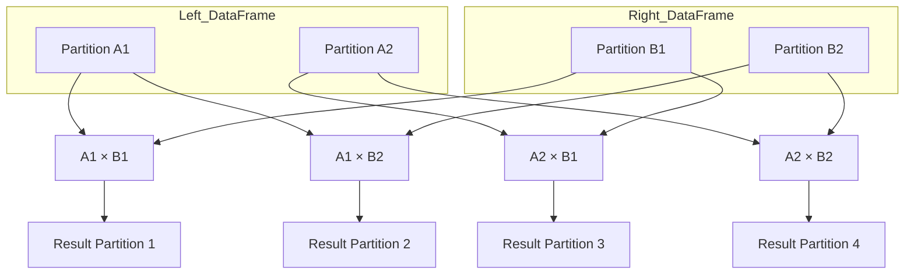

# :material-grid: Cartesian

A **Cartesian join** (also called a **cross join**) is the simplest join type in Spark SQL. It **does not require a join expression**—instead, it pairs **every row** from the left DataFrame with **every row** from the right DataFrame.

> :material-alert:️ **Warning:** Cartesian joins can be extremely expensive and may cause performance or memory issues if used carelessly.

### :material-sitemap: Overview

---

## :material-calculator: What Happens in a Cartesian Join?

- **Every combination** of rows from both DataFrames is returned.
- If DataFrame **A** has `m` rows and DataFrame **B** has `n` rows, the result will have `m × n` rows.
- **No join condition** is needed.
- **Use cases:** Generating all possible pairs, combinations, or when one side is very small.

---

## :material-rocket-launch: How Spark Executes a Cartesian Join

1. **Full Shuffle:** Both DataFrames are shuffled across all executors.
2. **Partition Pairing:** Every partition from the left is paired with every partition from the right.
3. **Cross Product:** Each pair forms a cross product (Cartesian product).
4. **Output Size:** Grows **quadratically**:  
    `numPartitionsA × numPartitionsB`

---

## :material-map:️ Visual Flow

---

## :material-lightbulb-outline: Key Takeaways

- Spark **fully shuffles** both DataFrames and computes the cross product between all partitions.
- **Not a broadcast join:** Both sides can be large, increasing risk of memory issues.
- **Potential for OutOfMemoryError:** Avoid unless necessary.
- **Best practices:**
  - Use only if one side is very small (consider `broadcast` + `explode`).
  - Use intentionally for generating all combinations.

---

**In summary:**  
Use Cartesian joins with caution—they are powerful but can be dangerous for large datasets!
