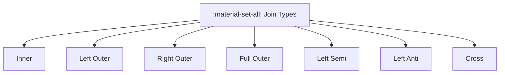

# :material-set-all: Join Types

Spark SQL supports multiple join types for different matching behavior.


### :material-sitemap: Overview



---

## �� Types

| Type | Description |
|------|-------------|
| Inner | Keep only matching rows |
| Left / Right | Keep all rows from one side |
| Full | Keep all rows from both sides |
| Left Semi | Keep rows from left with a match |
| Left Anti | Keep rows from left with no match |
| Cross | Cartesian product |

---

## :material-flask-outline: Example

```sql
SELECT * FROM a
LEFT JOIN b ON a.id = b.id;
```

---

## :material-brain: When to Use

| Scenario | Join Type |
|----------|-----------|
| Only matches | Inner |
| Keep unmatched left | Left |
| Exclude matches | Left Anti |
