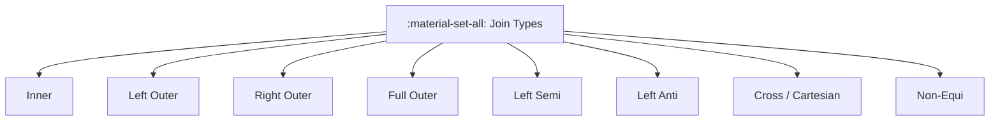

# :material-set-all: Join Types

Spark SQL supports multiple join types, each with different matching behavior and output shape.

---

## :material-sitemap: Overview



---

## :material-table: Types at a Glance

| Type | Keyword | Left Rows | Right Rows | Right Columns | NULLs |
|------|---------|:---------:|:----------:|:-------------:|:-----:|
| Inner | `JOIN` / `INNER JOIN` | Matched | Matched | Yes | None |
| Left Outer | `LEFT JOIN` | **All** | Matched | Yes | Right cols for unmatched |
| Right Outer | `RIGHT JOIN` | Matched | **All** | Yes | Left cols for unmatched |
| Full Outer | `FULL OUTER JOIN` | **All** | **All** | Yes | Both sides |
| Left Semi | `LEFT SEMI JOIN` | Matched | Not returned | No | None |
| Left Anti | `LEFT ANTI JOIN` | Unmatched | Not returned | No | None |
| Cross | `CROSS JOIN` | All | All (× n) | Yes | None |
| Non-Equi | any `JOIN … ON <, >, BETWEEN` | Conditional | Conditional | Yes | Varies |

---

## :material-flask-outline: Syntax Examples

```sql
-- Inner join (default)
SELECT o.order_id, c.name
FROM orders o
JOIN customers c ON o.customer_id = c.customer_id;

-- Left outer join
SELECT o.order_id, c.name
FROM orders o
LEFT JOIN customers c ON o.customer_id = c.customer_id;

-- Full outer join
SELECT COALESCE(o.id, c.id) AS id, c.name, o.amount
FROM orders o
FULL OUTER JOIN customers c ON o.customer_id = c.customer_id;

-- Left semi (existence check — no right columns)
SELECT o.*
FROM orders o
LEFT SEMI JOIN customers c ON o.customer_id = c.customer_id;

-- Left anti (missing records)
SELECT o.*
FROM orders o
LEFT ANTI JOIN customers c ON o.customer_id = c.customer_id;

-- Cross join (Cartesian product)
SELECT a.product, b.region
FROM products a
CROSS JOIN regions b;
```

---

## :material-brain: When to Use

| Scenario | Recommended Join Type |
|----------|-----------------------|
| Only matching rows | `INNER JOIN` |
| All left rows, optional right data | `LEFT JOIN` |
| All right rows, optional left data | `RIGHT JOIN` |
| All rows from both sides | `FULL OUTER JOIN` |
| Check if a record exists | `LEFT SEMI JOIN` |
| Find records absent from another table | `LEFT ANTI JOIN` |
| Generate all combinations | `CROSS JOIN` |
| Match on ranges or inequalities | Non-Equi join |

---

## :material-magnify: Behavior Notes

1. `LEFT SEMI JOIN` never returns columns from the right table — it is equivalent to a correlated `EXISTS` subquery.
2. `LEFT ANTI JOIN` is the recommended replacement for `NOT IN` with nullable key columns.
3. Nulls in join keys are **never equal** under `=`; use the null-safe operator `<=>` when keys may be NULL.
4. `CROSS JOIN` requires `spark.sql.crossJoin.enabled = true` on older Spark versions; on Databricks it is always permitted.
