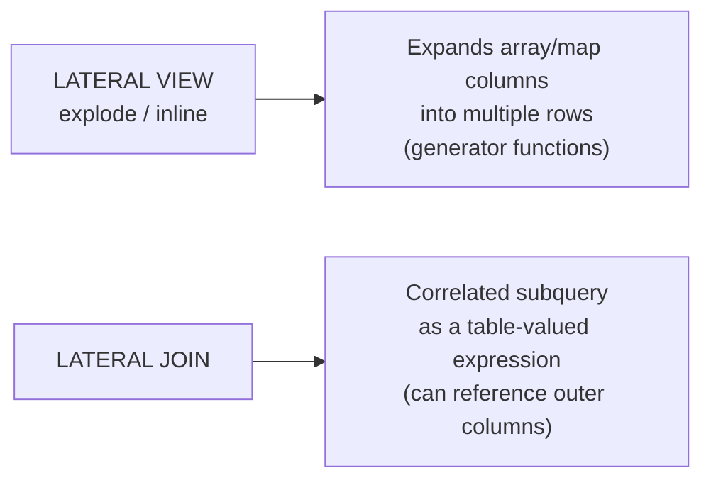

# :material-table-arrow-right: LATERAL JOIN

`LATERAL JOIN` (Spark 3.0+) allows a subquery in the `FROM` clause to reference columns from tables listed to its left — enabling correlated, row-by-row table-valued subqueries without LATERAL VIEW.

---

## :material-code-tags: Syntax

```sql
-- Implicit LATERAL (Spark default for subqueries that reference outer columns)
SELECT t.col1, s.col2
FROM table1 AS t,
LATERAL (SELECT ... FROM ... WHERE condition_on_t) AS s;

-- Explicit LATERAL JOIN
SELECT t.col1, s.col2
FROM table1 AS t
JOIN LATERAL (SELECT ... FROM ... WHERE condition_on_t) AS s
  ON TRUE;

-- LEFT JOIN LATERAL — preserve rows even when the subquery returns no rows
SELECT t.col1, s.col2
FROM table1 AS t
LEFT JOIN LATERAL (SELECT ... FROM ... WHERE condition_on_t) AS s
  ON TRUE;
```

| Element | Description |
|---------|-------------|
| `LATERAL (subquery)` | Correlated subquery that may reference outer table columns |
| `ON TRUE` | Required join condition when the subquery produces all its own rows |
| `LEFT JOIN LATERAL` | Preserves outer rows when the subquery returns 0 rows |

---

## :material-sitemap: LATERAL JOIN vs LATERAL VIEW



| Feature | `LATERAL VIEW` | `LATERAL JOIN` |
|---------|---------------|---------------|
| Purpose | Expand arrays / maps | Correlated row-by-row subquery |
| Input | Array / map column | Any subquery |
| References outer columns | Implicitly (via generator) | Explicitly (correlated) |
| Spark version | All | 3.0+ |

---

## :material-information-outline: Behavior

1. **Correlated evaluation** — the lateral subquery is re-evaluated for each row of the outer table, referencing its columns.
2. **`ON TRUE`** — use `ON TRUE` when the subquery is self-contained with the correlation condition inside the `WHERE`; the join condition is the subquery's output itself.
3. **`LEFT JOIN LATERAL`** — use when the correlated subquery may return zero rows (preserves the outer row with NULLs in subquery columns, equivalent to `LEFT JOIN`).
4. **Performance** — Spark's Catalyst optimizer attempts to decorrelate lateral subqueries into standard joins; in most cases there is no per-row loop overhead.

---

## :material-flask-outline: Practical Examples

### :material-numeric-1-circle: Latest order per customer (correlated top-1)

```sql
-- For each customer, get their single most recent order
SELECT c.customer_id, c.name, o.order_id, o.order_date, o.amount
FROM customers AS c
JOIN LATERAL (
    SELECT order_id, order_date, amount
    FROM orders
    WHERE customer_id = c.customer_id
    ORDER BY order_date DESC
    LIMIT 1
) AS o ON TRUE;
```

### :material-numeric-2-circle: Top-N items per group

```sql
-- Top 3 highest-revenue products per category
SELECT cat.category_name, p.product_id, p.product_name, p.revenue
FROM categories AS cat
JOIN LATERAL (
    SELECT product_id, product_name, revenue
    FROM products
    WHERE category_id = cat.category_id
    ORDER BY revenue DESC
    LIMIT 3
) AS p ON TRUE;
```

### :material-numeric-3-circle: LEFT JOIN LATERAL — customers with or without orders

```sql
-- Preserve customers even if they have no orders in the period
SELECT c.customer_id, c.name, o.order_date, o.amount
FROM customers AS c
LEFT JOIN LATERAL (
    SELECT order_date, amount
    FROM orders
    WHERE customer_id = c.customer_id
      AND order_date >= '2024-01-01'
    ORDER BY order_date DESC
    LIMIT 1
) AS o ON TRUE;
-- Customers with no 2024 orders appear with NULL order_date / amount
```

### :material-numeric-4-circle: Running aggregate from a correlated window

```sql
-- For each product, get the average of the 3 most recent daily sales
SELECT p.product_id, p.product_name, recent.avg_recent_units
FROM products AS p
JOIN LATERAL (
    SELECT AVG(units_sold) AS avg_recent_units
    FROM (
        SELECT units_sold
        FROM daily_sales
        WHERE product_id = p.product_id
        ORDER BY sale_date DESC
        LIMIT 3
    )
) AS recent ON TRUE;
```

### :material-numeric-5-circle: Unnest an array column with a correlated filter

```sql
-- For each order, expand only tags that contain the string 'priority'
SELECT o.order_id, tag.value AS priority_tag
FROM orders AS o
JOIN LATERAL (
    SELECT value
    FROM UNNEST(o.tags) AS t(value)
    WHERE value LIKE '%priority%'
) AS tag ON TRUE;
```

### :material-numeric-6-circle: LATERAL with VALUES — inline lookup table

```sql
-- Apply multiple discount tiers per product without a separate dimension table
SELECT p.product_id, p.price, tier.discount_pct,
       ROUND(p.price * (1 - tier.discount_pct / 100), 2) AS discounted_price
FROM products AS p
JOIN LATERAL (
    VALUES
        (CASE WHEN p.price >= 500 THEN 20
              WHEN p.price >= 100 THEN 10
              ELSE 5 END)
) AS tier(discount_pct) ON TRUE;
```

---

## :material-swap-horizontal: LATERAL JOIN vs Alternatives

```sql
-- Equivalent: QUALIFY (simpler for top-1 deduplication)
SELECT customer_id, order_id, order_date, amount
FROM orders
QUALIFY ROW_NUMBER() OVER (PARTITION BY customer_id ORDER BY order_date DESC) = 1;

-- Equivalent: LATERAL VIEW + explode (for array expansion)
SELECT order_id, tag
FROM orders
LATERAL VIEW explode(tags) AS tag;

-- LATERAL JOIN version of array expansion
SELECT o.order_id, t.tag
FROM orders AS o
JOIN LATERAL (SELECT value AS tag FROM UNNEST(o.tags) AS u(value)) AS t ON TRUE;
```

---

## :material-lightbulb-outline: When to Use

| Scenario | Recommended |
|----------|-------------|
| Top-N rows per group (complex ordering) | `JOIN LATERAL (... LIMIT N)` |
| Latest record per key | `JOIN LATERAL (... ORDER BY ts DESC LIMIT 1)` — or `QUALIFY` for simplicity |
| Correlated aggregation from a subquery | `JOIN LATERAL (SELECT AGG(...) WHERE key = outer.key)` |
| Outer rows with optional correlated data | `LEFT JOIN LATERAL` |
| Array expansion | `LATERAL VIEW explode` (simpler) or `JOIN LATERAL UNNEST` |

---

## :material-shield-outline: Common Pitfalls

| Mistake | Fix |
|---------|-----|
| Forgetting `ON TRUE` | Always add `ON TRUE` when the correlation is inside the subquery `WHERE` |
| Using `JOIN LATERAL` when `QUALIFY` suffices | For top-1 / top-N dedup, `QUALIFY` is simpler and equally fast |
| Omitting `LEFT JOIN` for optional relationships | Without `LEFT JOIN`, outer rows with no matching subquery rows are silently dropped |
| Correlated subquery without an index / partition filter | Ensure the correlated column is a partition key or use `BROADCAST` on the outer table |

!!! note "Decorrelation"
    Spark's Catalyst optimizer automatically decorrelates most lateral subqueries into
    efficient joins. Check `EXPLAIN FORMATTED` to confirm the plan is a join, not a
    nested loop.
