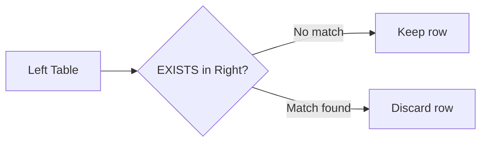
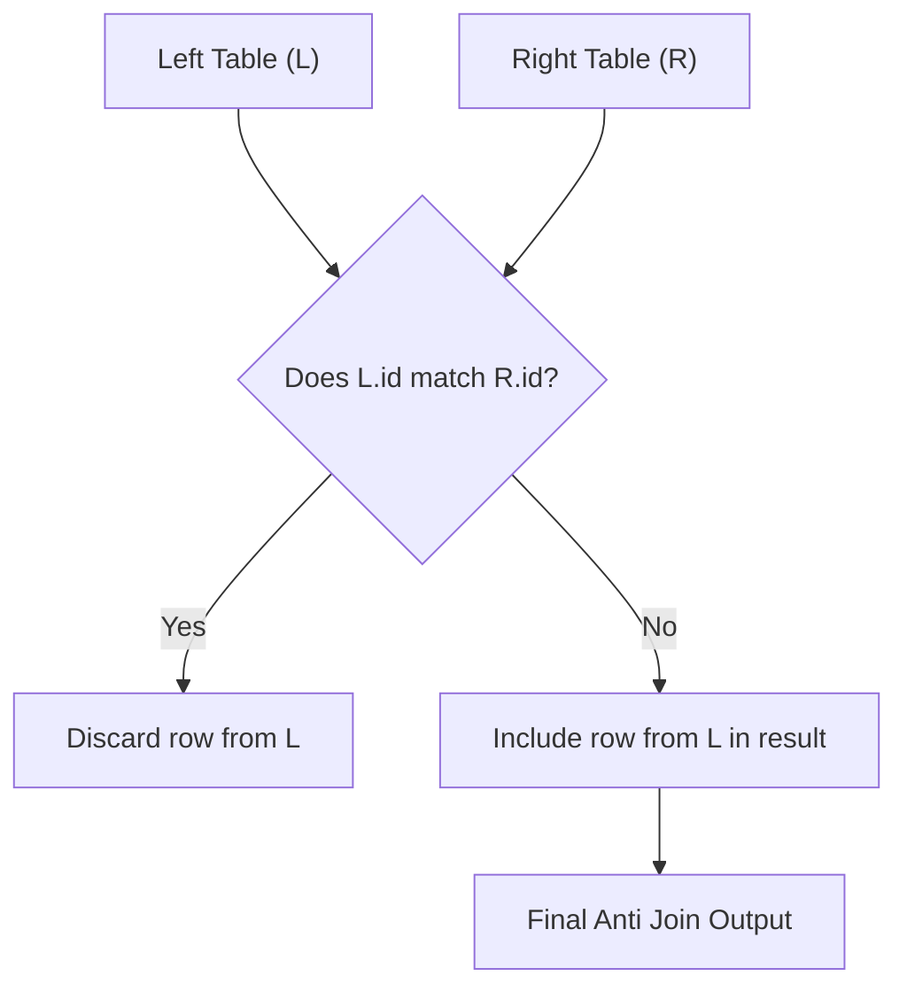

# :material-set-left: Left Anti

A **left anti join** returns **only the rows from the left table** that have **no matching rows in the right table**.  
It's perfect for finding records in one dataset that **do not exist** in another.


### :material-sitemap: Overview



---

## 🔎 What is a Left Anti Join?

- **Purpose:** Identify rows in the left table with **no match** in the right table.
- **Common Use:** Data validation, finding "orphan" records, implementing `NOT IN`/`NOT EXISTS` logic.

---

## 🔁 How Does It Work in Spark?

1. **Evaluate join condition** between left and right tables.
2. **Identify unmatched rows** in the left table.
3. **Return only** those unmatched rows.

---

## 🗺️ Visual Flow



---

## ⚙️ Spark Join Strategies

| Condition                  | Spark Strategy             |
|----------------------------|---------------------------|
| Join keys + equi-join      | Broadcast or Hash join    |
| No join key / non-equi     | Nested Loop Join          |
| Large input                | Sort-Merge Join if needed |

---

## 🏗️ Example: Employees & Departments

### Create Tables

```sql
DROP TABLE IF EXISTS employee;
DROP TABLE IF EXISTS department;

CREATE TABLE employee (
  id INT,
  name VARCHAR(50),
  age INT,
  department VARCHAR(50)
);

INSERT INTO employee (id, name, age, department) VALUES
  (1, 'John Doe', 30, 'IT'),
  (2, 'Jane Smith', 25, 'HR'),
  (3, 'Michael Johnson', 35, 'Finance'),
  (4, 'Mahfooz Doe', 30, 'HR');

CREATE TABLE department (
  department_id INT,
  department_name VARCHAR(50)
);

INSERT INTO department (department_id, department_name) VALUES
  (1, 'IT'),
  (2, 'HR'),
  (3, 'Finance'),
  (4, 'Admin');
```

---

### 🔗 Find Employees Without a Matching Department

```sql
SELECT
  *
FROM
  employee
LEFT ANTI JOIN department
  ON employee.department = department.department_name;
```

---

### 🟰 Equivalent SQL (NOT IN)

```sql
SELECT *
FROM orders o
WHERE o.customer_id NOT IN (
  SELECT id FROM customers
);
```

---

## 💡 Use Cases

| Use Case                        | Why Use Anti Join?                  |
|----------------------------------|-------------------------------------|
| Filter unmatched rows            | Find items not in a list            |
| Implement NOT IN / NOT EXISTS    | More scalable than subqueries       |
| Data validation / gap detection  | Track orphan rows, missing links    |

---

## 🚀 Optimization Tips

- **Broadcast hint** for small right tables:

  ```sql
  SELECT /*+ BROADCAST(department) */ ...
  ```

- Prefer **anti join** over `NOT IN` for performance.
- Ensure **join keys are NOT NULL** to avoid unexpected results.

---

> **Summary:**  
> Left anti joins are efficient for filtering out unmatched records, data validation, and scalable alternatives to subqueries in Spark SQL.
