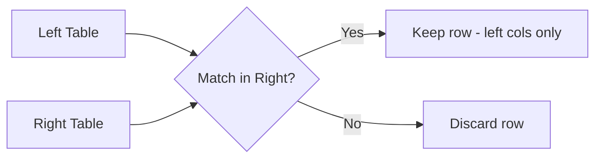
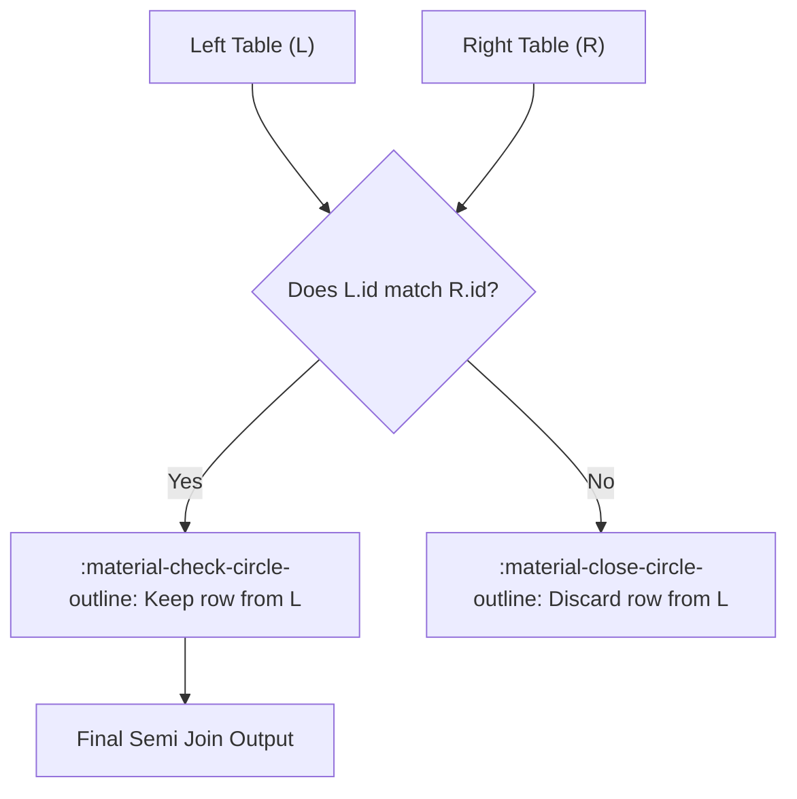

# :material-set-left: Left Semi

A **left semi join** returns rows from the left DataFrame that have at least one matching row in the right DataFrame—**but it never returns columns from the right DataFrame**.

> _“Give me all rows from A that exist in B, based on the join condition.”_


### :material-sitemap: Overview



---

## :material-lightbulb-outline: When to Use a Left Semi Join?

| Use Case                     | Why Use a Semi Join?                          |
|------------------------------|-----------------------------------------------|
| Existence filtering          | Return only rows that match                   |
| Faster than inner join       | Doesn't return right-side columns             |
| Efficient replacement for IN | Scalable, no duplicates                       |
| Joins in subquery filters    | Often used by Spark internally                |

---

## :material-repeat: How Does a Semi Join Work?

1. Spark evaluates the join condition for each row in the left DataFrame.
2. If **at least one match** is found in the right DataFrame, the row from the left is **retained**.
3. **No columns** from the right DataFrame are included in the output.

---

## :material-map:️ Visual Flow



---

## :material-lightning-bolt: Spark Execution Strategies

| Condition        | Join Strategy           |
|------------------|------------------------|
| Join keys + equi | Broadcast Hash Join    |
| Large data       | Sort-Merge Join        |
| No join key      | Nested Loop Join       |

---

## :material-pencil-outline: SQL Example

**All orders that have a valid customer:**

```sql
SELECT *
FROM orders o
LEFT SEMI JOIN customers c
  ON o.customer_id = c.id
```

---

## :material-refresh: SQL Equivalent (with `IN`)

```sql
SELECT *
FROM orders
WHERE customer_id IN (
  SELECT id FROM customers
)
```

> :material-alert:️ **Note:** `IN` can be less efficient and buggy with nulls—`LEFT SEMI JOIN` is safer and faster in Spark.

---

## :material-microscope: Comparing Join Types

| Join Type  | Left Only | Right Only | Matching | Output Columns         |
|------------|-----------|------------|----------|-----------------------|
| Inner      | :material-close-circle-outline:        | :material-close-circle-outline:         | :material-check-circle-outline:       | Left + Right          |
| Left Semi  | :material-check-circle-outline:        | :material-close-circle-outline:         | :material-check-circle-outline:       | Left only             |
| Left Anti  | :material-check-circle-outline:        | :material-close-circle-outline:         | :material-close-circle-outline:       | Left only (no match)  |

---

:material-shimmer: **Summary:**  
Use **left semi join** for efficient existence checks and subquery filters—especially when you only care about the left DataFrame’s rows and don’t need columns from the right.
