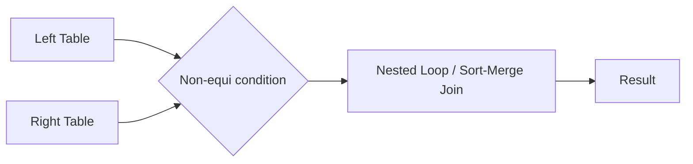
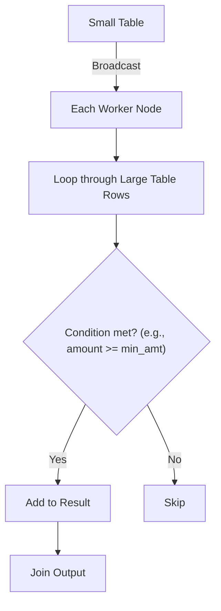

# :material-not-equal: Introduction

A **non-equi join** is a join where the condition is *not* based solely on equality (`=`). Instead, it uses operators such as:

- `<`, `>`, `<=`, `>=`
- `!=`, `BETWEEN`, or even complex expressions

> :material-alert:️ **Note:** Non-equi joins are not hashable. Spark cannot use efficient broadcast/hash joins for them, so it must fall back to more expensive join strategies (like sort-merge or nested loop joins).

### :material-sitemap: Overview

---

## What is a Non-Equi Inner Join?

Unlike a traditional inner join (which matches rows where column values are equal), a **non-equi inner join** matches rows based on non-equality conditions, such as:

- Greater than (`>`)
- Less than (`<`)
- Ranges (`BETWEEN`)
- Other complex logical expressions

These joins are often more complex and computationally expensive, especially with large datasets.

---

## :material-bookshelf: Use Cases

Non-equi joins are particularly useful for:

1. **Range-based joins:**  
    Joining data based on value ranges (e.g., date or numerical ranges).
2. **Time-series data joins:**  
    Joining on overlapping or adjacent time intervals.
3. **Interval matching:**  
    Finding records that fall within specific intervals or thresholds.

---

## :material-refresh: How Non-Equi Joins Work in Spark

**Explanation:**

- The small table is broadcast to all worker nodes.
- Each worker loops through the large table's rows.
- For each row, the non-equi join condition is evaluated.
- If the condition is met, the row is added to the result.

---

## :material-lightning-bolt:️ Key Points

- Non-equi joins are powerful for advanced analytics but can be slow on large datasets.
- Always consider data size and join conditions when designing Spark jobs.
- Where possible, filter or reduce data before performing non-equi joins.

---

> :material-lightbulb-outline: **Tip:** If possible, rewrite your logic to use equi joins for better performance, or pre-filter data to minimize the join workload.
