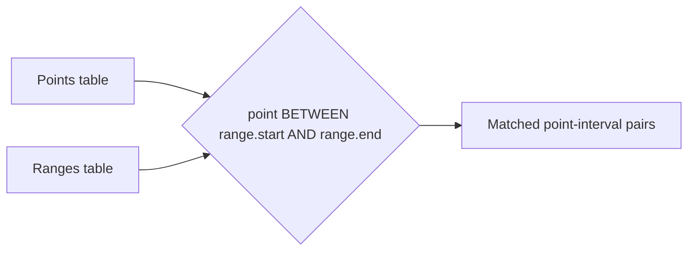

# :material-not-equal: Introduction

A **range join** occurs when two relations are joined using a *point-in-interval* or *interval-overlap* condition. Range join optimization in Databricks Runtime can deliver orders-of-magnitude performance improvements, but requires careful manual tuning.


### :material-sitemap: Overview



---

## :material-map-marker: Point-in-Interval Range Join

A *point-in-interval* range join matches a value from one relation that falls between two values from another relation.

```sql
SELECT *
FROM points
JOIN ranges ON points.p BETWEEN ranges.start AND ranges.end;
```

### Using Inequality Expressions

```sql
SELECT *
FROM points
JOIN ranges ON points.p >= ranges.start AND points.p < ranges.end;
```

### With Fixed-Length Interval

```sql
SELECT *
FROM points
JOIN ranges ON points.p >= ranges.start AND points.p < ranges.start + 100;
```

### Join Points Within a Fixed Distance

```sql
SELECT *
FROM points1 p1
JOIN points2 p2 ON p1.p >= p2.p - 10 AND p1.p <= p2.p + 10;
```

### Range Condition with Additional Join Conditions

```sql
SELECT *
FROM points, ranges
WHERE points.symbol = ranges.symbol
    AND points.p >= ranges.start
    AND points.p < ranges.end;
```

---

## :material-link: Interval-Overlap Range Join

An *interval-overlap* range join matches rows where intervals from each relation overlap.

### Overlap of `[r1.start, r1.end]` with `[r2.start, r2.end]`

```sql
SELECT *
FROM r1
JOIN r2 ON r1.start < r2.end AND r2.start < r1.end;
```

### Overlap of Fixed-Length Intervals

```sql
SELECT *
FROM r1
JOIN r2 ON r1.start < r2.start + 100 AND r2.start < r1.start + 100;
```

### Interval Overlap with Additional Join Conditions

```sql
SELECT *
FROM r1
JOIN r2 ON r1.symbol = r2.symbol
    AND r1.start <= r2.end
    AND r1.end >= r2.start;
```

---

## :material-lightning-bolt: Range Join Optimization

Range join optimization is applied when:

1. The join condition can be interpreted as a *point-in-interval* or *interval-overlap* range join.
2. All values in the range condition are of a numeric type (`integral`, `floating point`, `decimal`), `DATE`, or `TIMESTAMP`.
3. All values are of the same type (for `decimal`, also same scale and precision).
4. The join is an `INNER JOIN`, or for point-in-interval joins, a `LEFT OUTER JOIN` (point value on left) or `RIGHT OUTER JOIN` (point value on right).
5. A bin size tuning parameter is specified.

---

## :material-file-cabinet:️ Bin Size

The **bin size** is a numeric parameter that divides the value domain of the range condition into equal-sized bins.

- **Example:** With a bin size of 10, the domain is split into intervals of length 10.
        - If `p BETWEEN start AND end` and `start = 8`, `end = 22`, the interval overlaps bins `[0,10)`, `[10,20)`, and `[20,30)`.
        - Only points in these bins are considered for join matches.
        - If `p = 32`, it falls in `[30,40)`, so it can be excluded.

- **DATE values:** Bin size is in days (e.g., `7` = week).
- **TIMESTAMP values:** Bin size is in seconds (e.g., `60` = minute, `0.1` = 100 ms).

Specify the bin size via a range join hint or session configuration. The optimization is applied **only** if you manually set the bin size.

> **Tip:** See the section *Choose the bin size* for guidance on selecting an optimal value.

---
