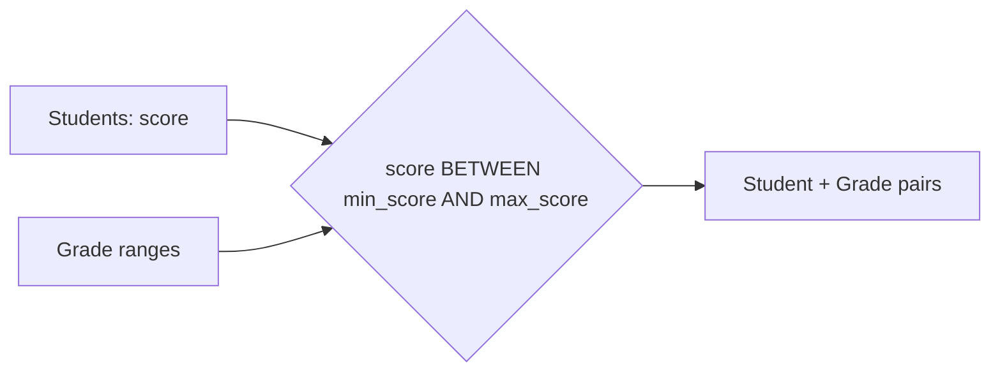

# :material-not-equal: Point-in-Interval

Learn how to map continuous values to intervals using a **range join** (also called a *point-in-interval* join) in Spark SQL. In this tutorial, we'll assign letter grades to students based on their scores.


### :material-sitemap: Overview



---

## 1️⃣ Create Tables

```sql
CREATE TABLE students_rj (
    id INT,
    name STRING,
    score INT
);

CREATE TABLE grade_range (
    grade STRING,
    min_score INT,
    max_score INT
);
```

---

## 2️⃣ Load Sample Data

### :material-account:‍:material-school: Insert Students

```sql
INSERT INTO students_rj (id, name, score) VALUES
    (1, 'Alice', 55),
    (2, 'Bob', 75),
    (3, 'Charlie', 85),
    (4, 'Diana', 65),
    (5, 'Eva', 70),
    (6, 'Frank', 90);
```

### :material-tag-outline:️ Insert Grade Ranges

```sql
INSERT INTO grade_range (grade, min_score, max_score) VALUES
    ('A', 85, 100),
    ('B', 70, 84),
    ('C', 50, 69),
    ('D', 35, 49),
    ('F', 0, 34);
```

---

## 3️⃣ Perform the Range Join

Assign each student a grade based on their score using a point-in-interval join:

```sql
SELECT
    s.id,
    s.name,
    s.score,
    g.grade
FROM
    students_rj s
JOIN
    grade_range g
ON
    s.score BETWEEN g.min_score AND g.max_score;
```

---

## 4️⃣ Example Output

| :material-identifier: | Name     | Score | Grade |
|----|----------|-------|-------|
| 1  | Alice    | 55    | C     |
| 2  | Bob      | 75    | B     |
| 3  | Charlie  | 85    | A     |
| 4  | Diana    | 65    | C     |
| 5  | Eva      | 70    | B     |
| 6  | Frank    | 90    | A     |

---

> :material-lightbulb-outline: **Tip:**  
> Range joins are powerful for mapping continuous values (like scores, timestamps, or prices) to categorical intervals.

---

**Next Steps:**  

- Try changing the grade ranges or adding more students.
- Explore using range joins for time intervals, pricing tiers, or other use cases!
